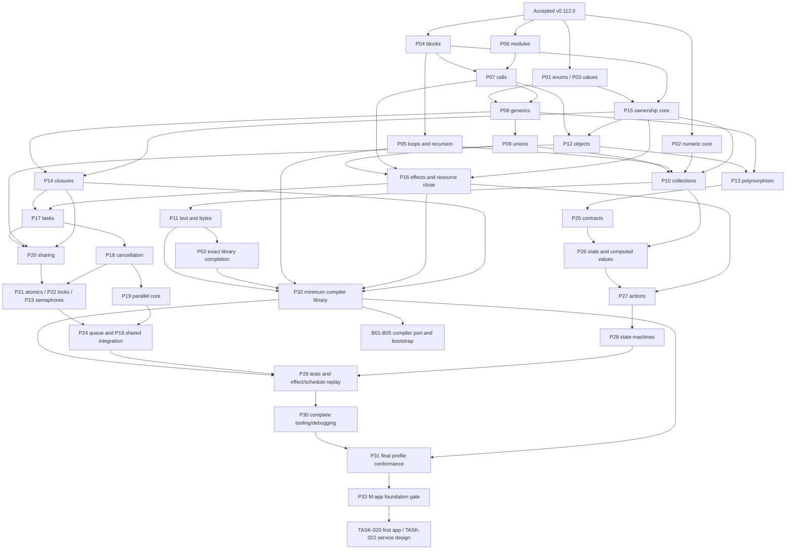

# PipeLang foundation dependency and verification plan

Status: proposed delivery plan; planning objective completed. P01 nominal enums subsequently selected
and approved; [the implementation objective](../agents/tasks/pipelang-reactive-application-language/nominal-enums.md)
records completed, accepted v0.113.0. P04.a general blocks are now selected and approved,
with implementation verification in progress. Remaining package proposals stay pending.
Baseline: accepted v0.112.0 at `9f5abd00fbc21ae2ab23178cc4fbe761903e5167`.
Read the [inventory](pipelang-foundation.md) for required scope and the
[contract proposals](pipelang-foundation-contracts.md) for C1–C8 and decisions D1–D6.
This is a locally researched design estimate, not newly executed capability proof, a version target,
a completion date, or authority to implement. Counts below replace the unvalidated conversational
120–200 additional slices; the older 50–80 estimate was withdrawn for a different scope.

## Evidence key

These are inspected source/contract anchors, supported by the admitted v0.112.0 terminal receipts.
A type shape, parser branch or future design contract does not establish executable completion.

| Key | Current evidence and its limit |
| --- | --- |
| E1 | [HIR pipeline tests](../../src/lib/pipelang/hir_pipeline_test.go), [Core operations/types](../../src/lib/pipelang/coreir/core.go), [Core admission](../../src/lib/pipelang/coreir/admission.go): accepted vertical pipeline and bounded operations; no general statement/object/task Core yet. |
| E2 | [Parser](../../src/lib/pipelang/parser.go), [AST](../../src/lib/pipelang/ast.go), [typechecker](../../src/lib/pipelang/typecheck.go): Class/Struct share parsing; current pure calls reject cycles; terminal expression/local shapes are restricted. |
| E3 | [Record tests](../../src/lib/pipelang/record_semantics_test.go), [construction](../../src/lib/pipelang/record_construction_test.go), [equality](../../src/lib/pipelang/record_equality_test.go): primitive-field immutable Record values; not arbitrary structs/references. |
| E4 | [Type reference tests](../../src/lib/pipelang/type_ref_test.go), [module tests](../../src/lib/pipelang/module_test.go), [module implementation](../../src/lib/pipelang/module.go): structured names, declaration conformance and locked imports; not authored general generics or executable dynamic dispatch. |
| E5 | [Text tests](../../src/lib/pipelang/text_semantics_test.go), [casefold](../../src/lib/pipelang/coreir/casefold.go), [trim](../../src/lib/pipelang/coreir/trim.go): selected scalar-aware text operations, not a complete encoding/byte library. |
| E6 | [Optional tests](../../src/lib/pipelang/optional_semantics_test.go), [list tests](../../src/lib/pipelang/record_list_test.go), [Result pipeline tests](../../src/lib/pipelang/hir_pipeline_test.go): bounded built-in carriers and collections, not general user unions/containers. |
| E7 | [Semantic projection](../../src/lib/pipelang/semantic_projection.go), [identity](../../src/lib/pipelang/semantic_id.go), [HIR graph tests](../../src/lib/pipelang/hir_dependency_graph_test.go): identities/spans/projections, not complete LSP/DAP/runtime debugging. |
| E8 | [Compiler contract](../agents/tasks/pipelang-reactive-application-language/compiler-contract.md#accepted-core-semantic-decisions) and [language surface](../agents/tasks/pipelang-reactive-application-language/language-surface.md): accepted design requirements/future examples; not executable effects, reactive state, tasks, contracts or bootstrap. |
| E9 | [v0.112 completion](../agents/tasks/pipelang-reactive-application-language/arrow-selector-value-arms.md), [verification architecture](../runtime/pipelang-verification.md), [contained runner](../../tests/containedexec/README.md): passed subset and harness/replay-of-campaign evidence; not authored language tests or effect/schedule replay. |

## F01–F34 disposition ledger

**Retain + extend** means the completed subset remains valid but the row is not complete for the
expanded foundation. **Required** means implement the stated deliverables before M-app. **Proposed
bounded scope** needs founder ratification. **Separate milestone** preserves required work with an
explicit later gate; it is not removal. P-numbers resolve to the dependency table below.

| ID | Current evidence | Remaining deliverables and completion disposition | Prerequisites / delivery owners |
| --- | --- | --- | --- |
| F01 | E1, E9; established subset | Retain + extend all new operations through typed HIR, verified Core, evaluator, Go and consumers; no source-only completion. | Every P slice; P33 integration gate |
| F02 | E1; int/float/bool checked subset, numeric representation metadata | Required fixed signed/unsigned widths, binary32/64, checked/explicit wrapping/saturating operations, conversion matrix, decimal precision/scale and complete documented operations. | P02; P03/P08/P10/P11 supply exact-number library dependencies |
| F03 | E5; partial text | Required immutable bytes, byte/scalar/grapheme distinction, source slices, strict decoding/encoding, normalization, parsing and version-pinned Unicode operations. | P02/P08/P10 → P11 |
| F04 | E1/E2 plus accepted v0.113.0 P01 | Nominal enum declarations, stable tags, construction/equality and exhaustive handling are delivered. Serialization and broader value/container integration remain. | P01 complete; P09/P32 wire integration, P03 value fields |
| F05 | E2/E3; bounded Records, Struct parser alias | Retain + extend nested values, copy/mutable-slot behavior, construction, fields/members, equality/hash/order capability rules; explicit migration from legacy Struct spelling. | D1 → P03; P07/P08/P10 composition |
| F06 | E2; configuration/default declarations | Required reference construction/identity, mutable fields, encapsulation, definite initialization, lifetime and leak-safe failed construction. | P03/P04/P07/P15 → P12 |
| F07 | E4; declaration conformance only | Required interface dispatch/substitution and abstract/virtual/override single-base model; broader inheritance scope requires D1. No blanket deferral. | P12 → P13; P25 override-contract integration |
| F08 | E4/E6; structured applied built-ins | Required user generic types/functions, constraints, instantiated identities, bounded expansion and carrier/container composition. Variance not implied. | P03/P06/P07 → P08 |
| F09 | E6; bounded Optional/Result | Required user tagged unions, exhaustive matching, typed payloads and general Result/Optional composition/propagation without implicit conversion. | P01/P04/P08 → P09 |
| F10 | E2/E9; public same-class pure calls | Required cross-type/module calls, visibility, overload resolution, methods and later callable/effect composition. | P04/P06 → P07; P13/P14/P16 finish integrations |
| F11 | E2; no callable values | Required typed lambdas/delegates, value and owner-local cell captures, lifetime and effect/shareability checks. | P07/P08/P15 → P14; P17/P20 cross-task refusal |
| F12 | E2/E9; immutable locals/terminal branches | Required lexical mutable slots, assignment, definite assignment, arbitrary statement sequence, early return, joins and evaluation-order proof. | C2 → P04 |
| F13 | E2; call cycles rejected | Required loops, accumulation, break/continue, nested control flow, recursion and declared logical step/depth exhaustion. | P04 → P05; P31 profile limits |
| F14 | E6; bounded lists | Retain + extend general element types, higher-order composition, immutable list operations and coherent bounds behavior. | P03/P08/P09 → P10; P14 callable integration |
| F15 | E6/E8; maps/sets/builders design only | Required insertion iteration, stable hash/equality/order, canonical wire order, scoped builders and iteration mutation refusal. | P02/P05/P08/P09/P15 → P10 |
| F16 | E1/E8; current value subset | Required complete alias/copy/capture lifetime rules, managed reclamation abstraction, resource close/use and profile obligations. | D3 → P15; P12/P14/P16/P20/P31 integrations |
| F17 | E4; locked structured module binding | Required authored imports/visibility, cross-module calls and source/lock distribution integration with inert resolution. | P06/P07; P32 compiler-library package proof |
| F18 | E8; design only | Required typed entrypoints/effect sets, governed bridge, errors/cancellation/progress/identity and deterministic close protocols. | P07/P09/P15 → P16; P18/P29 finish lifecycle/replay |
| F19 | E8; no executable language tasks | Required spawn/await, typed terminal outcomes, scoped ownership, suspension, joins and cleanup. | P14/P16 → P17; P18 completes cancellation |
| F20 | E8; workflow groups are not language proof | Required bounded fan-out, result/failure ordering, immutable pure inputs and traced effectful/shared parallelism. | P17/P18 → P19; P20–P24 integrations |
| F21 | E8; design only | Required cancellation/deadline arbitration, progress, cleanup, late external result reconciliation and operation-owned retry/idempotency metadata. | P16/P17 → P18; P23/P24 race coverage |
| F22 | E8; prior exclusion superseded | Required enforceable confinement, transitive shareability, guarded region aliases and visibility/happens-before. D3 pending. | P12/P14/P15/P17 → P20 |
| F23 | E1/E8; absent from executable Core | Required SC load/store/exchange/CAS/RMW on Bool/fixed integers with overflow and schedule proof. Object CAS/relaxed orders require separate decisions. | P02/P20 → P21 |
| F24 | E1/E8; absent | Required managed lock objects, scoped protection, ownership, non-reentrancy, rank ordering, no suspension and guaranteed release. | P15/P18/P20 → P22 |
| F25 | E1/E8; absent | Required permit tokens, wait/grant/cancel arbitration, release accounting, FIFO registration and timeout/cleanup behavior. | P17/P18/P20 → P23 |
| F26 | E8; undecided | Proposed bounded scope: one typed FIFO queue with close/drain, cancellation and backpressure. D5 must accept this or explicitly replace it; no silent omission or promise of all concurrent collections. | P19/P20/P23 → P24 |
| F27 | E8; missing | Required owned state snapshots, computed dependency graph, invalidation/cycle rules, canonical serialization and stable observer order. | P10/P12/P25 → P26 |
| F28 | E8; missing | Required validated atomic state transitions, typed events, effect-result application and observer commit boundary. | P16/P25/P26 → P27 |
| F29 | E8; design only | Required pre/post/invariants/refinements, old/result scopes, static discharge/runtime guards and public/override compatibility. | P04/P07/P09/P13 → P25 |
| F30 | E8; missing | Required guarded/terminal transitions, legal path metadata, traces and bounded state/path coverage. | P01/P09/P25/P27 → P28 |
| F31 | E9; compiler harness only | Retain + extend authored tests, generators/shrinkers, seeds, contract/path coverage, effect and concurrency replay with explicit exploration limits. | P09/P16/P18/P20–P28 → P29; early test API P32 |
| F32 | E7; partial spans/identities | Required complete typed graph, LSP queries, source maps, Go-backed DAP stepping/stacks/watches, task state and sanitized evidence. Target-specific non-Go mappings remain downstream. | Every slice emits metadata; P13/P17/P25/P29 → P30 |
| F33 | E8; design only | Required minimum compiler library at M-lib/M-app; compiler port and stage-0/1/2 bootstrap remain required at separate M-bootstrap. Explicit founder placement decision, no claim F33 is fully done at M-app. | P32; B01–B05 after M-lib |
| F34 | E8; profile design only | Required full/constrained/MCU capability admission, resource contracts, memory-plan checks and reference conformance; physical MCU/backend certification separate under D6. | Feature summaries from all P slices → P31; P33 milestone |

## Bounded implementation sequence

A **slice** is an approved end-to-end capability increment with one terminal proof after its final
material change. A **package** below groups related slices, not an authority to implement all of them.
No version numbers are assigned. The order is topological except where an explicit later integration
is named. C1–C8 define design prerequisites; D1–D6 must be settled only for affected slices.

Ownership notation: **V** = parser/typechecker, typed HIR, Core admission, evaluator, Core-only Go;
**L** = versioned standard library; **H** = governed host bridge and task runtime; **T** = compiler
semantic projection/editor/debug tooling; **A** = Application IR consumer; **P** = profile admission.
V always includes metadata T and consumer compatibility A, even when their implementations need
no change. Runtime mechanisms belong in generic language/runtime abstractions; no package-specific
business logic enters the DockPipe engine.

Every slice must: preserve frozen 45-source and all accepted post-legacy versions; add precise
source/Core refusal, value/order/error oracles and version/migration diagnostics; update canonical
reference, editor and semantic schema when affected; keep analysis inert; run the affected focused
checks, then mandatory terminal suite/matrix/integration/editor/containment and independent acceptance.
These shared obligations apply to **each** lower/upper slice below, including library and runtime
slices. Table evidence is additional capability-specific acceptance, never a replacement.

Stable sub-slice IDs are Pxx.a, Pxx.b and Pxx.c (B packages continue through .e).
For ranges, semicolon-separated outcomes describe the minimum slices in left-to-right ID order
when the lower bound exceeds one; a single-slice row is Pxx.a. The upper bound permits only the named integration split. If a package needs more, revise the
estimate from evidence and founder scope; do not silently manufacture expression-placement slices.

| Package | Slices | Dependencies | Outcome, ownership and additional acceptance; allowed upper-bound split |
| --- | --- | --- | --- |
| P01 | 1–2 | C1 enum tags | Nominal enums with construction/equality/exhaustive handling (V); all tags, unknown/duplicate member and missing-case refusal. Split declaration/value proof from matching integration if necessary. |
| P02 | 2–3 | C1 numeric decisions; exact library also P03/P08/P10/P11 | Fixed-width/binary numeric operation+conversion matrix (V); exact decimal value/library precision and scale (L,V). Test limits, NaN/signed zero, rounding and malformed encodings; split exact arithmetic from parse/format. |
| P03 | 2–3 | D1 value model; mutable Struct phase also P04 | Nested immutable Record values/copy/layout (V); distinct mutable-slot Struct values/construction/equality (V). Prove nested copies/reference-field alias classification, layout-cycle rejection and migration; split member capability integration. |
| P04 | 2–3 | C2 control-flow model | General lexical blocks/joins/early return (V); mutable slots and definite assignment (V). Independent evaluation traces and branch/call composition; split generalized expression placement closure only if cross-layer proof needs it. |
| P05 | 2–3 | P04 | Loops/break/continue/accumulation (V); recursion and deterministic depth/fuel (V,P). Test nested loops, early return, zero iterations, nontermination exhaustion and malformed back-edges; split mutual recursion integration. |
| P06 | 1–2 | C2 module contract | Authored locked imports, visibility and distribution identity (V,T). Wrong lock/private/ambiguous/cyclic imports reject without network; split package source-distribution integration. |
| P07 | 1–2 | P04/P06 | Cross-module/type functions, visibility/overloads and coherent call composition (V). Private/ambiguous/wrong-effects calls reject; split overload/member integration. |
| P08 | 2–3 | P03/P06/P07 | Generic functions/types and instantiated identities (V); capability constraints and expansion limits (V). Nested valid/invalid constraints and bounded compiler scaling; split polymorphic specialization integration. |
| P09 | 1–2 | P01/P04/P08 | User unions plus general Optional/Result composition/matching/propagation (V). Exhaustiveness, unchanged carriers and once-only branches; split generic carrier integration. |
| P10 | 2–3 | P02 numeric core/P05/P08/P09/P15 | General immutable lists/maps/sets (V,L); exclusive builders/stable hashing/order/canonical traversal (V,L). Collision/equality/order, bounds and iteration mutation tests; split builder lifecycle integration. Higher-order adapters also P14. |
| P11 | 2–3 | P02 numeric core/P08/P10 | Bytes, strict UTF-8 and scalar source slicing (L,V); grapheme/normalization/parse/format/encoding APIs with pinned data (L). Malformed input, boundary and locale-independence oracles; split grapheme data integration. |
| P12 | 2–3 | P03/P04/P07/P15 | Reference construction/identity/lifetime (V); fields/encapsulation/definite initialization (V). Alias, partial construction and escape refusal tests; split constructor failure/cleanup integration. |
| P13 | 2–3 | P08/P12/D1 inheritance | Interface dispatch/substitution (V); abstract/base/virtual/override rules (V). Dispatch traces, private members, invalid hierarchy and effects variance refusal; split generic dispatch integration. |
| P14 | 1–2 | P07/P08/P15 | Callable values and capture cells/lifetimes (V). Copy versus cell semantics, escaping borrow and callback effect refusal; split recursive/cell capture integration. |
| P15 | 2–3 | C3/D3 ownership rules, P03/P04 | Value/reference ownership and managed lifetime model (V); exclusive builders and deterministic resource scope primitives (V,H). Escape/use-after-consume, early-return/limit cleanup and alias tests; split resource protocol integration with P16. |
| P16 | 2–3 | P07/P09/P15 core | Typed entrypoints/effect closure/authority projection (V,H); explicit resource use/close and mock bridge outcomes (H,V). Pure-call refusal, inert analysis, close/body failure and missing-capability tests; split progress/idempotency metadata. |
| P17 | 2–3 | P14/P16 | Task spawn/await/typed outcomes (V,H); structured child scope/join/suspension (V,H). No orphan tasks, terminal uniqueness, capture and exhaustion tests; split nested-scope integration. |
| P18 | 1–2 | P17/D4 | Cancellation/deadline/cleanup arbitration and late effect outcome retention (V,H). Enumerate both sides of terminal/timeout races and failed close; split effect reconciliation integration. |
| P19 | 1–2 | P17/P18 | Pure and effectful bounded parallel maps/groups (V,H). Input-ordered outputs, deterministic failure aggregation, fan-out caps and unauthorized effects; split shared-mode integration after P20. |
| P20 | 2–3 | P12/P14/P15/P17/D3 | Transitive sharing/confinement checks (V); guarded Shared regions/visibility semantics (V,H). Alias promotion, captured cells and borrowed-reference escapes reject in source and Core; split interprocedural/generic escape integration. |
| P21 | 1–2 | P02 numeric core/P20/D5 | SC atomics and checked RMW/CAS (V,H). Independent small-step order model, overflow and schedule tests; split cross-task publication integration. |
| P22 | 1–2 | P15/P18/P20/D5 | Non-reentrant scoped locks, order keys and no-suspend effects (V,H). Release on every exit, inversion/self-lock/wrong-owner refusal and visible writes; split nested/dynamic rank integration. |
| P23 | 1–2 | P17/P18/P20/D5 | Semaphores with affine permits, FIFO waits and cancellation (V,H). Grant/cancel/timeout, over-release, leaks and await-under-permit tests; split nested cancellation integration. |
| P24 | 1–2 | P19/P20/P23/D5 queue choice | Bounded FIFO queue, safe message types, close/drain/backpressure (V,L,H). Full/empty/cancel/close races and no loss/duplication; split multi-producer trace integration. |
| P25 | 2–3 | P04/P07/P09/P13 | Preconditions/postconditions/refinements (V); invariants, old/result and override compatibility (V,T). Static/guard agreement, invalid publication and strengthened precondition refusal; split inheritance integration. |
| P26 | 2–3 | P10/P12/P25 | State owners and immutable serialized snapshots (V); computed graph/invalidation/cycles/observer order (V,T). No partial observation, duplicate notification or cyclic publication; split dynamic dependency integration. |
| P27 | 1–2 | P16/P25/P26 | Atomic validated actions/events/effect-result application (V,A). Failed action retains prior state, observers see one commit, no effects/await inside action; split reentrant event queue integration. |
| P28 | 1–2 | P01/P09/P25/P27 | State/transition metadata and guarded execution (V,T). Illegal/terminal/unreachable paths and depth-limited trace coverage; split generated path checks. |
| P29 | 2–3 | P09/P16/P18/P20–P28 | Authored tests/generators/shrinkers/contract checks (V,L,T); effect and schedule record/replay/model exploration (V,H,T). Missing trace or redacted input fails closed, no live replay effects; split schedule shrinking integration. |
| P30 | 2–3 | P13/P17/P25/P29; metadata incrementally in all slices | Complete semantic graph/LSP/source maps (T,V); Go-backed DAP stepping/stacks/watches/task state (T,H). Source/target breakpoints, suspended frames, typed values and sanitized failure bundles; split semantic rename/impact integration. |
| P31 | 2–3 | C8/D6; feature summaries from P01–P30/P32 | Capability closure plus constrained limits (P,V); MCU memory-plan/admission and reference execution (P,V). Unsupported targets fail before generation, full profile preserves semantics; split allocation-plan validation. Physical target certification excluded explicitly. |
| P32 | 2–3 | P05–P11/P14–P16; early authored-test subset from C7 | Compiler-needed diagnostics/spans/IDs/serialization/graphs and pure artifact interfaces (L,T); assertions/tables/goldens/seeds/replay API and representative compiler data workload (L). Prove source-only locked build, Unicode spans, canonical bytes and deterministic graph order; split library packaging/host-shell integration. No compiler port yet. |
| P33 | 1–1 | P01–P32, D1–D6 ratified | M-app foundation completion audit (V,L,H,T,A,P): every required row has accepted deliverables, complete compatibility/concurrency/profile/debug proof and inert Application IR integration. Produce remaining F33 bootstrap and physical-target ledger; no production app adapter in this slice. |

The graph splits P02 numeric core from exact library, P15 ownership core from effect-close
integration, P19 pure parallel core from shared integration, and P31 early profile design from final
admission. P03 immutable records can start independently; its mutable Struct phase also needs P04.
These are real dependencies, not circular implementation requirements. P32's initial test
API is implemented once and reused/extended by P29; P29 does not gate P32's minimum library. All
later integrations are mandatory before their package is closed at P33.

The table is authoritative for the full dependency set; the graph summarizes major paths. Work may
interleave independent packages, but this is not a request for parallel agents or additional workers.

## Milestones, estimates and assumptions

Adding the package ranges yields **52–84 further foundation slices** through M-app. This includes
P32's 2–3 minimum-library slices and P33's one completion audit. The lower bound combines compatible
integration work into the named vertical capabilities; the upper bound uses every listed split.
It is a decomposition range, not a statistical confidence interval.
Compared with the earlier conversational count, a slice here closes a coherent vertical capability
instead of counting each expression placement independently; the inventory has not shrunk. A version need not equal a slice.

The estimate assumes D1–D6 adopt the proposed bounded models, one Go executable backend plus the
Core evaluator, no reflection/macros/unsafe memory, no additional numeric families beyond the stated
contract, and preservation of all inherited proof. It includes language/runtime/library/tooling
implementation, not physical MCU certification or production Qt/HTTP adapters. It does not include
unbounded repair work from discoveries. Re-estimate after P01/P04/P15 from actual implementation and
proof cost; especially interprocedural ownership, general Core control flow and scheduler replay can
exceed the named splits. Do not convert this range into dates or final-version promises.

| Milestone | Required evidence | Additional work and placement |
| --- | --- | --- |
| M-lib: minimum self-hosting library | P32 plus transitive prerequisites; parser/binder-shaped data workload can use strict text, collections, generic values, modules, control flow, serialization, diagnostics and typed artifact boundaries. | P32 itself is 2–3 slices, **included** in 52–84. This is library readiness, not a self-hosted compiler or permission to skip foundation concurrency. |
| M-app: reviewed managed foundation | P01–P33 complete and decisions ratified; F01–F32 plus profile contracts and minimum F33 library. Explicit open ledger retains full F33 bootstrap and physical target implementations. | **52–84 slices**. Recommend beginning the first bounded TASK-020 app implementation here using the maintained Go seed. No early pivot after enums/loops alone. |
| M-port: compiler expressed in PipeLang | B01–B04 compile locked compiler sources and match seed outputs/diagnostics on independent corpus. | **8–16 additional slices** beyond prerequisites, not included in foundation range. May begin after M-lib if separately selected. |
| M-bootstrap: self-hosting proven | B05 stage-0/1/2 reproducibility and behavioral conformance; retain supported seed recovery. | **2–3 more slices**, **10–19 total port/bootstrap**. Foundation plus bootstrap: **62–103**, before app/target work. |
| Downstream app/targets | TASK-020 Application IR bindings/layout/events/accessibility, Qt generator/runtime, launcher contract parity, packaging; TASK-022 Service IR/HTTP/client/error/transaction contracts; separately governed deployment. | Not dependency-sized in this objective. Separate target dossiers must size these before promising a total product count; none are hidden inside 52–84 or 62–103. |

**Recommendation:** finish M-app, then start a first real app on the Go seed; schedule the compiler
port/bootstrap as a separately selected language milestone rather than a compulsory app-start gate.
This respects the requested broad foundation before apps while making explicit that full F33 still
remains. If the founder wants self-hosting before any app implementation, choose M-bootstrap as the
gate and budget the extra 10–19 slices. That ordering decision is not inferred from this document.
Neither choice authorizes app work now.

| Bootstrap package | Slices | Depends on | Outcome / ownership / acceptance |
| --- | --- | --- | --- |
| B01 | 2–4 | M-lib | PipeLang lexer/parser; source spans/recovery/diagnostics (V,L). Compare valid and malformed locked source corpora to independent seed/goldens. Upper splits: lexer Unicode/recovery, parser grammar families. |
| B02 | 3–5 | B01 | Binder/module identities; type/effect/ownership analysis; typed HIR lowering (V,L). Negative/positive conformance and stable projection digests. Upper splits: generic/dispatch and ownership/task integration. |
| B03 | 2–4 | B02 | Core verification/lowering; evaluator and explicit execution model (V,L). Malformed Core, step limits, value/order and schedule differential corpus. Upper splits: runtime features and profile admission. |
| B04 | 1–3 | B03 | Core-only Go emission plus compiler shell artifacts (V,L,H,T). Deterministic formatted target output, diagnostics/debug metadata and seed-equivalent consumer tests. Upper splits: debug projection and host-shell integration. |
| B05 | 2–3 | B04 | Stage-0/1/2 locked builds and normalized byte identity; full behavioral/negative/adversarial/bootstrap proof with recovery (V,L,T,P). Independent expected results; split reproducibility environment verification. |

All B slices inherit the same per-slice compatibility/tooling/terminal obligations as P slices.
No stage can bless its own expected output or retire the seed. Exact reproducible artifacts require
source/lock/compiler/library/backend/profile/toolchain digests and declared provenance normalization.
B01–B04 sum to 8–16; B05 makes 10–19. Second-native-backend and physical-target costs remain separate.

## Verification economics

Read existing receipts; no benchmark or semantic campaign was run for this planning objective.
The v0.112 proof root is
`/home/jamie/.codex/visualizations/2026/09/11/01a09287-8762-7e02-a5ca-da7b5be9ddea`.
Its `terminal-job.json`, `terminal-acceptance-job.json`, `terminal-comparison.json` and
`verification-data/campaigns/terminal/accepted-verification.json` agree with the owning completion
record. All 19 `terminal-source-postimages.json` entries matched on planning admission.

| Measured v0.112 receipt | Cost/evidence | Interpretation |
| --- | --- | --- |
| Fourth focused attempt | 46 cases, 67.233 s; 192 new scaling fixtures max 88.066 MiB / 0.413 s | Useful lower-scale development anchor for that narrow feature only; three earlier failed focused attempts are retained. No estimate of their uninspected durations. |
| Focused integration | Nine integration checks + editor, 97.607 s | Separate development check; do not add twice to the all-stage terminal job. |
| Terminal semantic stage | 855 functions / 8,837 cases, 5,338.378 s (88.97 min) | All fresh, zero semantic reuse; two workers, retained verified binaries; not a cold-cache measure. |
| All-stage terminal job | 6,040.783 s (100.68 min) | Includes suite, 2,904 direct compiler probes, integration/editor and orchestration; difference from suite is about 11.71 min, not a standalone matrix measurement. |
| Independent acceptance | 228.197 s (3.80 min) | Digest, source, resource, inherited ordered audits/native execution and cleanup reconciliation. |
| Required terminal total | 6,268.980 s = **104.483 min = 1.741 h** | One complete successful v0.112 proof, excluding focused work, failed attempts and implementation time. |
| Resource proof | max direct compile 88.871 MiB / 1.213 s; job peak 1,614,802,944 bytes; zero OOM/swap, cleanup complete | Under fixed 128 MiB/5 s direct caps and contained aggregate limits. No basis for raising limits. |
| Retained evidence/cache | 104,172,433,801 bytes at acceptance under a 112 GiB configured budget | Historical size, not current free-space assertion; future runs must check capacity without deleting protected evidence. |

**Development loop:** inspect dependency closure and author independent positive/rejection/order
oracles; run the changed feature tests and affected Core/runtime/editor/consumer checks under canonical
containment; repair from failed evidence. For this earlier narrow slice, successful focused plus
integration was about 2.75 minutes. A new object or task model is materially broader, so do not promise
that time. Plan multiple focused iterations and measure them separately. Do not run the full suite
after every mechanical checkpoint, and do not treat focused green results as release acceptance.

**Terminal rule:** after the last material change in an approved slice, run one fresh complete campaign
and independent acceptance. Retain all discovered cases, frozen compatibility, independent Value/Trace
oracles, ordered inherited source/fixture audits, fresh native child execution/directories, fresh direct
compiler probes, Application IR/editor integration and cleanup proof. Binaries/build preparation may
be reused only under verified identities; semantic results cannot replace requested fresh execution.
A valid resumed campaign may admit its already completed receipts; changed relevant inputs invalidate
the affected closure. Unknown dependency scope fails closed. No new batching or policy is accepted here.

Keep offline Go 1.25.13, normal GC/inlining, preparation-only `GOMEMLIMIT=600MiB`, 128 MiB/5 s direct
compile limits and existing child/per-unit deadlines. Retain the canonical shared 2 GiB/384-task
job limits, zero swap, at most two workers, 512 MiB/64-task coordinator and verified process-tree cleanup;
[the verification architecture](../runtime/pipelang-verification.md#invariants-and-acceptance) owns the
remaining high/proactive/unit limits. Logical language fuel is not a substitute for this containment.

At a constant v0.112 terminal cost, **52–84 slices cost 90.6–146.3 terminal hours**. This is an arithmetic
floor scenario if future campaigns cost at least as much; it is not a measured future floor or labor
estimate. With 25% additional full-equivalent reruns the same corpus costs **113.2–182.8 hours**; with
one full rerun per slice, **181.1–292.6 hours**. These rates are planning scenarios, not observed failure
probabilities. Focused failures, cold population and implementation/review time are additional.
A 2× larger/slower terminal campaign doubles every number; a 1.5× campaign multiplies it by 1.5.
Do not infer wall-clock schedule from summed hours or run more workers outside current containment.

Expected workflow is several focused runs and one successful terminal per slice, with extra terminal
work only after material drift or failure. The latest evidence supports that workflow and records
three focused failures before success; it does not establish a long-term rerun rate. Reserve the
25% scenario for planning discussion and revise from the next three coherent slices' actual receipts.

### Measured gains already available and remaining investigation

The [verification architecture](../runtime/pipelang-verification.md#measured-schedule-adoption--performance-round-two)
records a same-source warm paired schedule: whole job plus independent acceptance fell from
4,901.51 s to 4,618.95 s, **5.76%**. That is v0.109 evidence, not a promised v0.112/future gain.
Profile identities must match changed source/host/policy and retained binary digests; singleton remains
the fallback. Do not alter old profile identities to force admission. The earlier 60.22% suite reduction
included warm cache differences and is not a scheduler-only or cold-cache speed claim.

| Opportunity | Required investigation before adoption | Policy boundary |
| --- | --- | --- |
| Coherent capability slices | Record total focused + terminal time per capability, regression yield and review effort across P01/P04/P15; compare to equivalent completed work, not raw version count. | This plan proposes larger coherent objectives; it does not waive any terminal checks. |
| Compatible bounded grouping | Use current matching profiles, matched singleton controls, exact flattened case/order/native-child audits and complete workflow totals. | Existing opt-in schedule only; no worker/timeout/cap increase. |
| Artifact identity/reconciliation cost | Measure hashing/publication and final audit separately, distinguish nested summed spans from wall time; evaluate safe immutable content identity only with mutation/corruption proof. | No stat-only digest cache or skipped rehash authorization. |
| Generalized control-flow proof families | Investigate how to retain every inherited case and add broad composition checks without redundant future placement families; quantify storage/run/review cost. | Removing/replacing accepted coverage is an acceptance-policy proposal requiring separate review and evidence; no test reduction here. |
| Concurrency verification | Measure small-step schedule inventory/explosion, reductions only when equivalent explored behaviors are proven, and native instrumentation overhead. | Do not call bounded schedule sampling exhaustive; current resource limits remain. |

No optimization research or benchmark campaign is selected. Content-addressed resume and preserved
receipt ancestry already address interruption cost; resumption does not turn old semantic results
into a fresh acceptance run. Preserve caches and stop on insufficient space instead of deleting proof.

## Implementation choices — P01 subsequently selected and approved

1. **P01 nominal enums (recommended).** One coherent 1–2-slice package: declaration/member identity,
   typed values/equality and exhaustive handling through all layers. It unlocks unions/state machines
   with fewer unresolved ownership decisions. First objective should cover primitive payload-free
   enums and exhaustive matching across ordinary supported contexts, plus current-version refusal;
   wire integration remains explicitly owned by P09/P32. The approved objective uses explicit nonempty string tags and no implicit integer conversion;
   wire integration remains separate. No approval of classes/concurrency implied.
2. **P04 general blocks and mutable locals.** A 2–3-slice package that attacks current composition
   limitations and unlocks loops. First objective: coherent lexical block/return/branch join model;
   mutable slots follow inside the selected approved scope. Settle mutability spelling, definite
   assignment, unreachable-code policy and staged fuel requirements. Higher Core/evaluator risk than P01.
3. **P03 value semantics.** A 2–3-slice package for nested immutable records followed by distinct
   Struct copy/mutable-slot rules. First objective: nested Record construction/projection/equality
   and rejection of recursive value layouts. Settle D1 value/reference distinction and structural
   equality/hash constraints before Struct semantics. Class inheritance remains a later D1 decision.

Selection and exact implementation approval remain distinct under TASK-021 governance. D3 safe
sharing is the most consequential later choice; D4 cancellation, D5 synchronization/queue scope and
D6 profile/app/bootstrap milestone interpretation remain explicit pending decisions. Choosing a first
slice does not silently accept all proposals or waive the expanded F01–F34 requirements.

## P01 delivery receipt

Subsequent [performance and compression research](../research/pipelang-performance-compression.md#combined-roadmap-for-the-foundation-goals)
connects the v0.113.0 verification receipts to an integrated performance roadmap:
identity/scheduling, native consumption of encoded data, compact compiler structures,
exact cold storage, and optional hybrid execution. Its measurements and hypotheses
remain distinct; it does not revise the original slice estimates or select the next
language capability. The earlier v0.112 economics above remain historical evidence.

P01 was delivered as one coherent v0.113.0 capability with fresh complete verification. The
[nominal-enum objective](../agents/tasks/pipelang-reactive-application-language/nominal-enums.md)
records scope, failures repaired, final inventory, resource maxima and measured proof time.
The planning totals above remain original estimates, not a revised remaining-work count. F04-wide
serialization and later packages are still open; completion of P01 does not authorize another package.

The approved [identity/fixture performance follow-up](../agents/tasks/pipelang-reactive-application-language/identity-fixture-performance.md)
is complete: bounded toolchain-buffer reuse is retained, streaming fixtures were
rejected, and a fresh full campaign plus independent acceptance preserves all
v0.113.0 proof. It selects no additional foundation or language capability.

## Approved Qt boundary continuation

The [Qt integration boundary](pipelang-qt-boundary.md) applies the completed pilot
to owned conversion, typed outcome presentation and target-side lifetime/delivery.
This is bounded adapter proof, not completion of P15/P16/P17/P20 or ratification of
D1-D6. The approved continuation also repairs the recorded zero-argument record
transport panic within existing contracts, advancing F01/F05/F14 correctness
without selecting another P-number. Go v0.113.0 remains the accepted backend.

## Approved P04.a general blocks

The founder selected P04.a and explicitly approved general lexical blocks, joins and
returns. [The objective](../agents/tasks/pipelang-reactive-application-language/general-blocks.md)
owns implementation and pending verification at v0.114.0. Approval settles only this
bounded C2 control-flow contract; P04.b mutation and P05 loops/fuel remain open.
Other package proposals and unrelated D1–D6 decisions remain pending.
