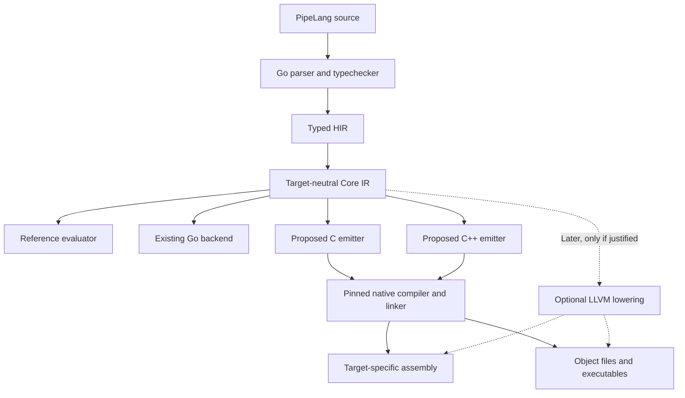

# PipeLang native backends and footprint strategy

## Direction and status

The user requested this write-up after identifying a conflict between PipeLang's
**fast, low-footprint** goal and its growing verification artifact set. The requested
direction is to keep the compiler implementation in Go while supporting C++, C and
assembly/native output through the existing target-neutral Core IR boundary.

The design below began as a proposal. The user subsequently approved the bounded
[C++ / assembly / Qt pilot](../research/pipelang-cpp-qt-pilot.md), now implemented
and evaluated as an experimental integration path. Broader backend promotion,
full-language porting, installation, cache deletion and limit changes remain
outside that pilot. The original performance protocol below is retained as the
bar for a later performance adoption claim; the pilot does not establish it.
The accepted executable language remains v0.113.0 with the Go backend. The
[TASK-021 index](../agents/tasks/pipelang-reactive-application-language/index.yaml)
owns objective state. Recovery is completed; the subsequent
[footprint investigation](../research/pipelang-footprint-attribution.md) is planning
only and grants no backend implementation authority. The existing self-hosting
milestone is independent: native backend work does not require a compiler rewrite
or silently retire that milestone.

The design must succeed on application size and execution cost **and** compiler,
verification and retained-development cost. A passing semantic suite or spare disk
capacity alone is insufficient evidence that the design meets those goals.

## What the measurements establish

| Recorded scope | Evidence | Interpretation |
| --- | --- | --- |
| Earlier `complete-artifacts` cache | 3,079 executable entries, 14,390,546,687 bytes (13.402 GiB) | Historical executable-cache snapshot; not a current full-coverage baseline |
| Recent accepted v0.113.0 suite | 15,142 referenced executable identities, 70,973,989,613 binary bytes (66.10 GiB) | Roughly five times the artifact count; average executable size is broadly similar |
| Recent configured cache/evidence scope | 104,899,071,378 logical bytes under a 112 GiB limit | Includes more than the referenced executable set; not total machine usage or uniquely allocated storage |
| Recent paired full-run comparison | 112.870 to 104.655 minutes, including independent acceptance | Historical sequential warm comparison; both runs already used the large cache |
| Recovery loader diagnostic | Approximately 74.1 GB of logical artifact reads per full admission pass | Read volume, including repeated references; neither new stored bytes nor measured physical disk traffic |

Sources: [earlier executable accounting](../agents/tasks/pipelang-reactive-application-language/conformance-execution-performance.md),
[current measurements and limitations](../research/pipelang-performance-compression.md),
and [verification contract](../runtime/pipelang-verification.md).

These snapshots establish a storage concern. They do not identify every growth
contributor, prove that the growth bought speed, establish who approved the larger
budget, or show that an equivalent C/C++ implementation is faster or smaller. The
14 GiB figure is a useful reference, not permission to discard coverage until the
new workload fits an older workload's size.

The current disk gate stops on configured capacity/headroom exhaustion. It does
not reject growth relative to an accepted performance baseline. The proposed gates
below add that missing comparison; a larger capacity setting cannot substitute for
an explicit decision about a regression.

## Keep the compiler; extend its output boundary

The [Go emitter](../../src/lib/pipelang/gobackend/generate.go) consumes only
[Core IR](../../src/lib/pipelang/coreir/core.go) as its PipeLang dependency. Parsing,
typechecking and [HIR-to-Core lowering](../../src/lib/pipelang/hir_lowering.go) are
separate. The [Core evaluator](../../src/lib/pipelang/coreeval/evaluate.go) provides
an existing behavioral reference for backend comparison.

Retain the Go frontend, semantic analysis, Core contracts, evaluator and existing
Go implementation. Add emitters and runtime support behind Core. Generated C/C++
applications need not carry the Go runtime if their runtime and host bridges are
native. Go remains a development dependency for building/running the compiler;
its own binaries and caches must still be counted.

Equivalent generated native code does not become faster merely because the
frontend itself is rewritten in C++. Any later frontend rewrite would need its
own compiler-performance evidence. Backend expansion can be evaluated independently.

### Output contracts

| Output | Intended role | Required definition before implementation |
| --- | --- | --- |
| Go | Maintained accepted backend and comparison control | Preserve current language, compatibility, profile and toolchain identities |
| C | Portable source generation and native integration with explicit support code | C dialect, ABI, type/layout mapping, required runtime, compiler flags and target profile |
| C++ | Native source generation and integration with C++ consumers/libraries | C++ dialect, ABI, ownership/runtime mapping, exception policy, library dependencies and target profile |
| Assembly | Inspectable source for a named processor/OS/ABI | Architecture, CPU feature baseline, calling convention, syntax, compiler flags and corresponding object/executable proof |
| Object/library/executable | Runnable or linkable native artifacts | Linking mode, exported ABI, startup/runtime dependencies, relocation and packaging rules |

Assembly is target-specific. Initially obtain it from the same pinned C/C++
compilation path used to build the executable. GCC supports stopping at assembly
with `-S`; this provides assembly output without implementing register allocation,
instruction selection and calling conventions ourselves. A direct LLVM lowering
is a later option if measured needs justify its toolchain, integration and support
cost. LLVM can emit assembly or object code; it does not automatically provide
readable C/C++ source emitters. [GCC output stages](https://gcc.gnu.org/onlinedocs/gcc/Overall-Options.html),
[LLVM code generator](https://llvm.org/docs/CodeGenerator.html).

Keep shared semantic lowering and runtime contracts common where that preserves
clarity. Separate target syntax, ABI/layout and platform mechanics. A C++ output
mode must have a defined useful contract; merely compiling generated C as C++ does
not establish idiomatic C++ integration. Artifact names and CLI switches remain
design work, not newly accepted command-line surfaces.

## Preserve one language across backends

Every backend must implement PipeLang's accepted semantics rather than inherit
the target language's defaults. The initial implementation scope is an explicitly
declared subset of accepted Core, with unsupported programs rejected before code
generation. A pilot does not establish full v0.113.0 backend support.

Required mappings include:

- Fixed-width values, checked arithmetic, conversions and failure outcomes.
- Strict text encoding, pinned Unicode behavior, comparison and ordering.
- Records, enums, collections, Optional/Result values and malformed-value refusal.
- Evaluation order, short circuiting, lazy branches, once-only execution and calls.
- Value copying, ownership, allocation and cleanup, with a declared runtime model.
- Stable semantic identities, diagnostics, source maps and inert Application IR
  compatibility where the selected scope intersects those contracts.

Full managed allocation, object identity, tasks and concurrency must follow the
foundation contracts as those capabilities are accepted. Emitting C/C++ does not
make these services free or permit target-specific semantics. Native runtime
libraries, shared dependencies, debug information and support tables all count in
the delivered footprint. Small executables that shift cost into uncounted shared
libraries do not qualify as storage savings.

The existing test corpus can supply cases, input vectors, expected outcomes and
independent oracles. Its Go-specific test wrappers, generated checking programs,
compiler invocation, resource accounting and artifact identities require adapters.
Preserve independent expected-result logic: comparing two backends that share the
same incorrect lowering is insufficient. Identical Core is an input boundary,
not proof of equivalent execution.

## Fix artifact economics alongside backend work

The current harness multiplies executable overhead across thousands of artifacts.
Go's usual static-linking model contributes runtime/support bytes to its binaries,
but changing the output language does not fix excessive artifact creation,
retention or repeated verification. [Go runtime and binary-size explanation](https://go.dev/doc/faq).

Maintain a distinct accounting ledger for:

| Category | Accounting requirement |
| --- | --- |
| Installed compiler/toolchain | Compiler executable, Go development requirements and optional native toolchains |
| Application deployment | Executable plus required runtime/shared libraries/assets/debug distribution |
| Active verification working set | Distinct executables, checking code and dependencies needed by the frozen current corpus |
| Historical evidence | Retained receipts, fixtures, prior generations, rejected candidates and supporting artifacts |
| Build caches and scratch | Go/native compiler caches, objects, intermediates and temporary peak storage |
| Verification reads | Logical bytes hashed/decoded, distinct bytes referenced, repeated-read factor and physical I/O when measurable |

Report logical file bytes and uniquely allocated bytes separately. Distinguish
planned savings, candidate storage, retained originals and actual freed bytes.
Classify old and duplicate objects without deleting them during analysis.

Backends should be selected explicitly for a workload. Installing support for
four output formats must not automatically populate four persistent artifact
sets. A conformance run may compare multiple backends, but must declare their
combined temporary and retained budgets. Optional toolchains should not become
mandatory application deployment dependencies.

Artifact reuse must bind source, Core, checks, fixtures, backend/runtime version,
target/ABI, flags and toolchain identity. Investigate hashing each distinct artifact
once only within a proven unchanged lifetime; a path/mtime cache is insufficient.
Any immutable storage, sealing or mutation-watch design needs its own failure and
invalidation proof. Keep fresh semantic/native execution even when compiled code
is safely reused. Archive/rebuild/prune policy is separate from backend correctness
and requires explicit preservation and cleanup authority.

## Performance and footprint gates

Before a prototype runs, freeze its corpus, target, control, accounting roots,
toolchain settings, repetitions and numeric budgets in a reviewable manifest.
Inventory existing tools first; installation is not assumed. No automatic budget
increase, narrower coverage or weaker proof may convert a failing candidate into
a passing one.

| Gate | Proposed acceptance rule |
| --- | --- |
| Semantics | Exact required values, traces, errors and ordered coverage agree with independent oracles; unsupported features fail closed |
| Application footprint | Count all required support; candidate must fit the selected absolute budget and improve or stay within the matched control |
| Verification storage | Gate both total active bytes and growth from the matched baseline; separately bound combined experimental peak and retained evidence |
| Speed | Measure clean build, warm incremental build, execution, whole verification and recovery separately; gains must exceed measured variation |
| Memory/CPU | Record frontend, native compiler, application and coordinator costs separately; expose any regression rather than hiding it in a wall-time gain |
| I/O | Report total logical validation reads and duplication; do not label repeated reads as new stored data or physical device traffic |
| Reuse/recovery | Corruption, replaced inputs, changed flags/runtime/toolchain, interruption and cleanup must invalidate or recover correctly |
| Promotion | Require a demonstrated speed or footprint benefit, no unapproved regression on the other axis, and complete proof for the advertised capability scope |

The [completed inventory and numeric proposal](../research/pipelang-footprint-attribution.md#concrete-budget-proposal-for-review)
now recommend 16 GiB active executables, 32 GiB inclusive active estate, 8 MiB per
pilot application and 2/3 GiB retained/peak incremental experiment budgets.
Adoption remains a founder decision; these are not implemented limits or proven
feasible targets. The 112 GiB capacity setting does not become the product target
by inheritance.

Keep existing two-worker containment, native/raw controls, normal accepted build
settings, 128 MiB/5-second isolated compiler proof and the 512 MiB coordinator cap
as the admitted baseline. If a native compiler cannot meet an applicable contract,
report that result; any revised contract requires a separate explicit decision.
Do not silently apply Go-specific settings to a different compiler and call the
comparison equivalent. Define corresponding target settings before measurement.

## Recommended delivery sequence

These are proposed milestones, not implementation authorization or a time estimate.

1. **Establish storage causality and budgets.** Reconcile earlier/current scopes,
   artifact counts, feature growth, generation changes, stale retained objects,
   debug/runtime duplication and cache policy. Trace budget changes and their
   recorded authority. Freeze a current matched control and the absolute/growth
   gates; do not rerun the entire suite merely to inventory existing evidence.
2. **Run one bounded native-backend comparison.** Keep the Go frontend. Recommend
   beginning with a small C++ emitter for a declared Core subset, including a
   representative numeric/control case and an allocating text/record/collection
   case. Compare against Go with identical input/oracle coverage and inclusive
   runtime costs. Derive assembly from that same native toolchain. Do not tune only
   an empty program or report a subset as full backend support.
3. **Decide from complete-path evidence.** Continue only if speed/footprint gains
   survive compilation, validation, support libraries and artifact lifecycle cost.
   Reject or revise the candidate when the gains disappear. Compare a C emitter
   over the same subset before choosing shared runtime/ABI arrangements that would
   make C an expensive retrofit.
4. **Expand conformance deliberately.** Grow C/C++ capability manifests, runtime
   coverage, diagnostics and test adapters toward the accepted language contract.
   Run required independent terminal proof at each advertised support boundary.
   Keep the Go backend available as a supported control and recovery path.
5. **Consider direct native lowering only when needed.** Evaluate LLVM or a direct
   assembly backend only against a quantified limitation of the C/C++ path. Select
   each target/ABI explicitly; one host result does not certify every architecture.

Before step 2, decide the first target/toolchain and C/C++ dialects, numeric
budgets, runtime/linking policy and exact pilot capability inventory. Broader host
integration, full managed runtime implementation and debugger support need their
own scoped estimates. The existing foundation delivery estimate assumed one Go
backend; it must not be quoted as including these additional backends.

## Bounded C++ pilot proposal

This is the reviewable candidate scope following the footprint investigation.
It remains unselected and unimplemented. First implement the recommended
package-input/inclusive-budget repair if approved; the native pilot is a separate
objective. It preserves the Go compiler, `coreir.Program`, Core validation,
`coreeval.EvaluateProgram`, the Go backend and independent expected-result logic.
No parser/AST shortcut, engine change, new CLI contract or full v0.113 native
support claim is included.

### Installed tools and target

Live version/path inventory is in `footprint/toolchains.json` under the
2026-09-13 investigation evidence root. Commands inspected versions and library
locations only; no compiler workload, installation or download ran.

| Tool | Observed installation |
| --- | --- |
| Accepted Go control | Cached Go 1.25.13, `linux/amd64`, absolute module-toolchain path |
| PATH Go | `/usr/local/go/bin/go`, 1.25.0; do not substitute for the accepted control |
| C/C++ | `/usr/bin/gcc`, `/usr/bin/g++`, GCC 11.4.0; `cc`/`c++` resolve to these |
| Assembler/linker/ELF inspection | GNU binutils 2.38 (`as`, BFD `ld`, `readelf`, `objdump`, `strip`) |
| Build orchestration | CMake 3.22.1; a build-system dependency is unnecessary for eight programs |
| Not found on PATH | Clang/Clang++, LLD, NASM, Ninja, ccache; no claim of machine-wide absence |

Recommend one target: Linux x86-64 SysV ABI, baseline x86-64 CPU, C++17 with
`g++-11 -std=c++17 -O2 -g -march=x86-64 -mtune=generic`, default exceptions and
RTTI, no LTO/PGO/stripping. Record resolved compiler/linker, headers, libraries and
flags before the pilot; command availability does not prove contained compilation
capability. Keep normal Go optimization/inlining and debug information, offline
cached Go 1.25.13, no unapproved build-setting changes.

Use ordinary dynamic C++ runtime linking for the initial candidate, but charge
its full transitive closure for each standalone application and once for the
eight-application union. Installed candidate support files currently include
libstdc++ 2,260,296 bytes, libgcc_s 125,488, libc 2,220,400, libm 940,560 and the
loader 240,936: **5,787,680 bytes** if all are needed. This is an available-file
inventory, not the yet-unbuilt program's measured dependency closure. The Go
compiler/toolchain (189,412,951 bytes for the pinned tree) remains a development
cost even when the generated application has no Go runtime dependency.

Static archives are installed (libstdc++.a 6,018,836 and libgcc.a 3,001,414 bytes),
but archive size is not final linked support size. If dynamic inclusive costs fail
the Go comparison, report failure; a static variant requires its own predeclared
comparison and budget, not an uncounted post-hoc substitution.

### Capability and oracle manifest

Freeze **eight small programs, 160 valid input vectors and 32 negative vectors**
before implementation measurements. Use explicit inputs, no random regeneration.
Each program has 20 valid vectors; negatives are split between malformed runtime
inputs and malformed/unsupported Core, recorded separately from valid execution.

| Programs | Supported behavior and required vectors | Existing proof source |
| --- | --- | --- |
| N1–N2 | Signed 64-bit checked add/subtract/multiply/negate/divide, Result success/error and helper calls; zero, extrema, overflow, division by zero and minimum/-1 | Checked-arithmetic and checked-propagation tests |
| C1–C2 | Immutable locals, bool short circuit, nested terminal/conditional selection, lazy unused failing arm, once-only argument/call evaluation | Conditional and terminal selector tests; independent ordered Value/Trace cases |
| A1 | Owned UTF-8 text in records, construct/project/equal/ordinal compare, copied values; empty, multibyte, embedded NUL, scalar-order boundaries | `text_semantics_test.go`, record construction/semantics tests |
| A2 | List of text-bearing records: empty/singleton/append/count; returned collection must preserve caller-owned input and ordering | `record_list_append_test.go`, `record_list_count_test.go` |
| A3 | List index with Optional record result; valid/negative/out-of-range positions, empty/nonempty, duplicate values | `record_list_at_test.go`, `optional_record_test.go` |
| A4 | Allocating filter by ordinal text field, fresh result ownership; no matches, all matches, duplicate records, long heap-backed strings | `record_list_filter_by_text_test.go` |

The allocation rows include text longer than 64 bytes and collection lengths
0, 1, 16 and 256, so small-string/literal or empty-program behavior cannot satisfy
the screen. Enumerate the exact 20 vectors per row in the implementation manifest
before running. All selected source shapes must already lower through the Go
frontend; if a combination is not accepted, fix the proposed manifest within
accepted semantics before implementation approval, never widen the language.

Implement a C++ capability validator rejecting every unsupported Core type,
expression, malformed value or contract version before emission. Pilot exclusions:
floats, other integer widths, enums, case folding/trim/locale-sensitive text,
sorting, arbitrary generics, tasks/concurrency, object identity, host services,
full managed GC, debugger integration and direct machine-code generation. These
remain accepted or planned elsewhere; the pilot does not change their Go support.

Use generated structs plus owned UTF-8 storage, value-copy lists and RAII cleanup;
default C++ exceptions stay an implementation detail. Result arithmetic errors
must be explicit PipeLang tags, not C++ exceptions or undefined signed overflow.
Check bounds before the native operation, including minimum/-1 division. Emit
sequenced temporaries to preserve Core evaluation order. Avoid locale operations;
validate text and reproduce the pinned scalar-order contract. Validate the whole
transported record/list value, including unused fields. Allocation failure is a
bounded process failure, never a fabricated successful Result. Any uncovered
ownership/lifetime semantic is a refusal, not an invented language behavior.

For each vector: independently authored expected values/errors/traces, current
Core evaluator, Go executable and C++ executable must agree. Backend parity alone
is insufficient. Expected arithmetic should use separate wide-integer/reference
logic; text/list expected results use fixed tables and existing independent
oracles, not helpers from either emitter. Add wrong-result/wrong-trace controls
that demonstrably fail the comparison. Inject malformed UTF-8/carriers at the
host adapter boundary, and unsupported Core in the pre-emission validator.

### Adapter and output architecture

The emitter is implemented in Go, depends only on Core and backend-local support,
and exposes an explicit pilot capability manifest. Reuse source fixtures and
oracle definitions; adapt Go `testing.T`, generated assertions, panic/refusal
transport, entrypoint names and compiler invocation explicitly. A tiny C++ check
runner emits canonical value/error/trace records; the independent Go-side checker
validates them. Fresh native children and fixtures remain mandatory.

Keep two accounting lanes: deployable application plus runtime, and generated
conformance executable plus check adapter. Both backends execute identical work in
each lane. Do not compare a Go `go test` binary containing a framework/oracle to a
C++ application main and call the difference backend savings. Charge the Go
orchestrator, checker, compiler binary and caches as development support on both
sides; inspect application dependencies rather than assuming Go linking mode.

Future C output consumes the same Core capability/runtime contracts with C17
syntax, explicit owned structs, allocation/free and tagged errors. It is a separate
emitter/adaptation, not a frontend rewrite or automatic C++ ABI export. Keep the
runtime interface implementable without STL types at a future C boundary.
Assembly output initially uses `-S` from the pinned C++ compilation, then the same
assembler/linker and flags to prove executable behavior. `-c` produces objects;
neither requires a register allocator in the Go compiler. Assembly is one named
target's artifact and must be charged alongside retained source/object/debug data.
[GCC 11.4 output-stage documentation](https://gcc.gnu.org/onlinedocs/gcc-11.4.0/gcc/Overall-Options.html).

### Matched comparison and decision

Freeze corpus hashes, Core identities, target/ABI, expected outputs, backend/runtime
sources, adapters, toolchain/header/library identities, flags, accounting roots,
budgets and repetitions. Refuse drift rather than selecting convenient historical
timings. Preserve all existing originals; create only declared experiment artifacts.

| Measurement | Matched protocol |
| --- | --- |
| Clean compiler and application build | Three independent empty private build/output-cache roots per backend. Include frontend build separately and end-to-end frontend/emission/compiler/link time. Installed tools remain present; do not call this cold device cache or drop host caches. |
| Warm unchanged and incremental build | Five alternating Go/native pairs, with order reversed between pairs. Measure unchanged rebuild and the same predetermined literal change separately. Every changed source has fresh identity; cached results never replace execution. |
| Application execution | All 160 vectors in fresh children; ten paired repetitions. Report startup-inclusive wall and separately enough repeated operations to measure steady work above timer noise. Same operation counts, outputs and allocation lifetimes; no empty-program proxy. |
| RAM/CPU | Per frontend, compiler/linker, checker and native child RSS, plus hierarchical aggregate peak, CPU and memory/swap events. Preserve two workers, 512-MiB coordinator, existing unit/job limits and independent 128-MiB/5-second compiler probes. Native compiler failure under applicable ceilings is a result, not authority to raise them. |
| Runtime footprint | Executable + unstripped debug + assets + transitive shared libraries/loader; list installed-only development dependencies separately. Report both standalone and union totals, including adapter binaries. |
| Verification/recovery | Time fixture generation, evaluator, independent oracle, identity reads, compile/link, native execution, reconciliation and independent acceptance separately. One fresh full **pilot** run and one intentional interrupted/resumed pilot; this is not the whole v0.113 suite. |
| Storage and I/O | Measure initial, per-phase, high-water and retained bytes across all roots, existing originals, candidate/control support and temporary objects/copies. Count logical validation reads by trust boundary; capture `io.stat`/process read-byte deltas when available, otherwise unknown. Do not infer physical I/O from logical reads. |

No destructive cache-reset between repetitions: private empty roots establish
clean-build conditions and their retained contents count against the combined
2-GiB retained/3-GiB incremental-peak proposal. Precompute the worst-case allocation;
if it cannot fit, stop before running and revise the proposal explicitly. At most
one canonical artifact per program/backend/lane is selected for steady runs;
clean-build copies and all proof still count in retained totals. Eight programs
do not authorize constructing the 15,142-artifact corpus for each backend.

Report paired medians, spread and every failed unit. Proposed pilot go/no-go:
all semantic/refusal/invalidation checks pass; all absolute budgets pass;
standalone inclusive application bytes do not regress; selected verification
artifact/support union is at least **25% smaller**; and end-to-end pilot verification
and execution medians regress by no more than **5%**, clean build by no more than
**10%**, with RAM within fixed limits and no more than 5% above matched Go peaks.
Claim a speed improvement only if it exceeds 10% and observed paired variation.
If noise spans a threshold, report inconclusive rather than extending the run
without a bounded revised plan. These thresholds are a proposal for adoption.

Corruption, replaced executable/source/fixture, changed runtime/toolchain/flags,
interruption and unsupported-Core refusal must invalidate/recover correctly. Use
isolated copies for fault injection; no mutation of protected accepted artifacts.
Promotion beyond this subset requires its own complete conformance/integration
proof and approved footprint allocation. Passing the pilot establishes only this
eight-program target/capability result.

## Completion of this write-up

This planning checkpoint delivers the architecture, output roles, semantic and
runtime obligations, storage accounting, promotion gates and proposed sequence.
It makes no new speed, size, backend-conformance or implementation-completion
claim. No compiler, harness, schema, runtime or cache changes are part of this
write-up. Future work should reference this proposal and select a bounded scope
before implementation.
