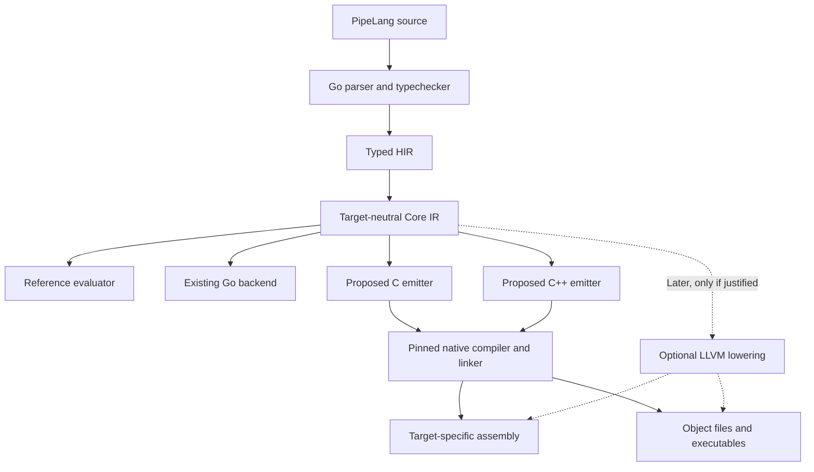

# PipeLang native backends and footprint strategy

## Direction and status

The user requested this write-up after identifying a conflict between PipeLang's
**fast, low-footprint** goal and its growing verification artifact set. The requested
direction is to keep the compiler implementation in Go while supporting C++, C and
assembly/native output through the existing target-neutral Core IR boundary.

This is a design and evaluation proposal, not an implemented backend or approval
to port code, install toolchains, run campaigns, delete caches or raise limits.
The accepted executable language remains v0.113.0 with the Go backend. The
[TASK-021 index](../agents/tasks/pipelang-reactive-application-language/index.yaml)
continues to own the active implementation objective; this side-conversation
write-up does not replace the ongoing recovery work. The existing self-hosting
milestone is independent: native backend work does not require a compiler rewrite
or silently retire that milestone.

The design must succeed on application size and execution cost **and** compiler,
verification and retained-development cost. A passing semantic suite or spare disk
capacity alone is insufficient evidence that the design meets those goals.

## What the measurements establish

| Recorded scope | Evidence | Interpretation |
| --- | --- | --- |
| Earlier `complete-artifacts` cache | 3,079 executable entries, approximately 14 GiB | Historical executable-cache snapshot; not a current full-coverage baseline |
| Recent accepted v0.113.0 suite | 15,142 referenced executable identities, 70,973,989,613 binary bytes (66.10 GiB) | Roughly five times the artifact count; average executable size is broadly similar |
| Recent configured cache/evidence scope | 104,899,071,378 logical bytes under a 112 GiB limit | Includes more than the referenced executable set; not total machine usage or uniquely allocated storage |
| Recent paired full-run comparison | 112.870 to 104.655 minutes, including independent acceptance | Historical sequential warm comparison; both runs already used the large cache |
| Recovery loader diagnostic | Approximately 74.1 GB of logical artifact reads per full admission pass | Read volume, including repeated references; neither new stored bytes nor measured physical disk traffic |

Sources: [earlier executable accounting](../agents/tasks/pipelang-reactive-application-language/conformance-execution-performance.md),
[current measurements and limitations](../research/pipelang-performance-compression.md),
and [verification contract](../runtime/pipelang-verification.md).

These snapshots establish a storage concern. They do not identify every growth
contributor, prove that the growth bought speed, establish who approved the larger
budget, or show that an equivalent C/C++ implementation is faster or smaller. The
14 GiB figure is a useful reference, not permission to discard coverage until the
new workload fits an older workload's size.

The current disk gate stops on configured capacity/headroom exhaustion. It does
not reject growth relative to an accepted performance baseline. The proposed gates
below add that missing comparison; a larger capacity setting cannot substitute for
an explicit decision about a regression.

## Keep the compiler; extend its output boundary

The [Go emitter](../../src/lib/pipelang/gobackend/generate.go) consumes only
[Core IR](../../src/lib/pipelang/coreir/core.go) as its PipeLang dependency. Parsing,
typechecking and [HIR-to-Core lowering](../../src/lib/pipelang/hir_lowering.go) are
separate. The [Core evaluator](../../src/lib/pipelang/coreeval/evaluate.go) provides
an existing behavioral reference for backend comparison.

Retain the Go frontend, semantic analysis, Core contracts, evaluator and existing
Go implementation. Add emitters and runtime support behind Core. Generated C/C++
applications need not carry the Go runtime if their runtime and host bridges are
native. Go remains a development dependency for building/running the compiler;
its own binaries and caches must still be counted.

Equivalent generated native code does not become faster merely because the
frontend itself is rewritten in C++. Any later frontend rewrite would need its
own compiler-performance evidence. Backend expansion can be evaluated independently.

### Output contracts

| Output | Intended role | Required definition before implementation |
| --- | --- | --- |
| Go | Maintained accepted backend and comparison control | Preserve current language, compatibility, profile and toolchain identities |
| C | Portable source generation and native integration with explicit support code | C dialect, ABI, type/layout mapping, required runtime, compiler flags and target profile |
| C++ | Native source generation and integration with C++ consumers/libraries | C++ dialect, ABI, ownership/runtime mapping, exception policy, library dependencies and target profile |
| Assembly | Inspectable source for a named processor/OS/ABI | Architecture, CPU feature baseline, calling convention, syntax, compiler flags and corresponding object/executable proof |
| Object/library/executable | Runnable or linkable native artifacts | Linking mode, exported ABI, startup/runtime dependencies, relocation and packaging rules |

Assembly is target-specific. Initially obtain it from the same pinned C/C++
compilation path used to build the executable. GCC supports stopping at assembly
with `-S`; this provides assembly output without implementing register allocation,
instruction selection and calling conventions ourselves. A direct LLVM lowering
is a later option if measured needs justify its toolchain, integration and support
cost. LLVM can emit assembly or object code; it does not automatically provide
readable C/C++ source emitters. [GCC output stages](https://gcc.gnu.org/onlinedocs/gcc/Overall-Options.html),
[LLVM code generator](https://llvm.org/docs/CodeGenerator.html).

Keep shared semantic lowering and runtime contracts common where that preserves
clarity. Separate target syntax, ABI/layout and platform mechanics. A C++ output
mode must have a defined useful contract; merely compiling generated C as C++ does
not establish idiomatic C++ integration. Artifact names and CLI switches remain
design work, not newly accepted command-line surfaces.

## Preserve one language across backends

Every backend must implement PipeLang's accepted semantics rather than inherit
the target language's defaults. The initial implementation scope is an explicitly
declared subset of accepted Core, with unsupported programs rejected before code
generation. A pilot does not establish full v0.113.0 backend support.

Required mappings include:

- Fixed-width values, checked arithmetic, conversions and failure outcomes.
- Strict text encoding, pinned Unicode behavior, comparison and ordering.
- Records, enums, collections, Optional/Result values and malformed-value refusal.
- Evaluation order, short circuiting, lazy branches, once-only execution and calls.
- Value copying, ownership, allocation and cleanup, with a declared runtime model.
- Stable semantic identities, diagnostics, source maps and inert Application IR
  compatibility where the selected scope intersects those contracts.

Full managed allocation, object identity, tasks and concurrency must follow the
foundation contracts as those capabilities are accepted. Emitting C/C++ does not
make these services free or permit target-specific semantics. Native runtime
libraries, shared dependencies, debug information and support tables all count in
the delivered footprint. Small executables that shift cost into uncounted shared
libraries do not qualify as storage savings.

The existing test corpus can supply cases, input vectors, expected outcomes and
independent oracles. Its Go-specific test wrappers, generated checking programs,
compiler invocation, resource accounting and artifact identities require adapters.
Preserve independent expected-result logic: comparing two backends that share the
same incorrect lowering is insufficient. Identical Core is an input boundary,
not proof of equivalent execution.

## Fix artifact economics alongside backend work

The current harness multiplies executable overhead across thousands of artifacts.
Go's usual static-linking model contributes runtime/support bytes to its binaries,
but changing the output language does not fix excessive artifact creation,
retention or repeated verification. [Go runtime and binary-size explanation](https://go.dev/doc/faq).

Maintain a distinct accounting ledger for:

| Category | Accounting requirement |
| --- | --- |
| Installed compiler/toolchain | Compiler executable, Go development requirements and optional native toolchains |
| Application deployment | Executable plus required runtime/shared libraries/assets/debug distribution |
| Active verification working set | Distinct executables, checking code and dependencies needed by the frozen current corpus |
| Historical evidence | Retained receipts, fixtures, prior generations, rejected candidates and supporting artifacts |
| Build caches and scratch | Go/native compiler caches, objects, intermediates and temporary peak storage |
| Verification reads | Logical bytes hashed/decoded, distinct bytes referenced, repeated-read factor and physical I/O when measurable |

Report logical file bytes and uniquely allocated bytes separately. Distinguish
planned savings, candidate storage, retained originals and actual freed bytes.
Classify old and duplicate objects without deleting them during analysis.

Backends should be selected explicitly for a workload. Installing support for
four output formats must not automatically populate four persistent artifact
sets. A conformance run may compare multiple backends, but must declare their
combined temporary and retained budgets. Optional toolchains should not become
mandatory application deployment dependencies.

Artifact reuse must bind source, Core, checks, fixtures, backend/runtime version,
target/ABI, flags and toolchain identity. Investigate hashing each distinct artifact
once only within a proven unchanged lifetime; a path/mtime cache is insufficient.
Any immutable storage, sealing or mutation-watch design needs its own failure and
invalidation proof. Keep fresh semantic/native execution even when compiled code
is safely reused. Archive/rebuild/prune policy is separate from backend correctness
and requires explicit preservation and cleanup authority.

## Performance and footprint gates

Before a prototype runs, freeze its corpus, target, control, accounting roots,
toolchain settings, repetitions and numeric budgets in a reviewable manifest.
Inventory existing tools first; installation is not assumed. No automatic budget
increase, narrower coverage or weaker proof may convert a failing candidate into
a passing one.

| Gate | Proposed acceptance rule |
| --- | --- |
| Semantics | Exact required values, traces, errors and ordered coverage agree with independent oracles; unsupported features fail closed |
| Application footprint | Count all required support; candidate must fit the selected absolute budget and improve or stay within the matched control |
| Verification storage | Gate both total active bytes and growth from the matched baseline; separately bound combined experimental peak and retained evidence |
| Speed | Measure clean build, warm incremental build, execution, whole verification and recovery separately; gains must exceed measured variation |
| Memory/CPU | Record frontend, native compiler, application and coordinator costs separately; expose any regression rather than hiding it in a wall-time gain |
| I/O | Report total logical validation reads and duplication; do not label repeated reads as new stored data or physical device traffic |
| Reuse/recovery | Corruption, replaced inputs, changed flags/runtime/toolchain, interruption and cleanup must invalidate or recover correctly |
| Promotion | Require a demonstrated speed or footprint benefit, no unapproved regression on the other axis, and complete proof for the advertised capability scope |

The precise application, active-cache and experimental storage caps remain a
founder decision after inventory. Returning toward the earlier 14 GiB executable
footprint is a candidate goal to evaluate against current coverage, not an already
approved limit or a claimed feasible result. The recent 112 GiB capacity setting
does not become the new product target by inheritance.

Keep existing two-worker containment, native/raw controls, normal accepted build
settings, 128 MiB/5-second isolated compiler proof and the 512 MiB coordinator cap
as the admitted baseline. If a native compiler cannot meet an applicable contract,
report that result; any revised contract requires a separate explicit decision.
Do not silently apply Go-specific settings to a different compiler and call the
comparison equivalent. Define corresponding target settings before measurement.

## Recommended delivery sequence

These are proposed milestones, not implementation authorization or a time estimate.

1. **Establish storage causality and budgets.** Reconcile earlier/current scopes,
   artifact counts, feature growth, generation changes, stale retained objects,
   debug/runtime duplication and cache policy. Trace budget changes and their
   recorded authority. Freeze a current matched control and the absolute/growth
   gates; do not rerun the entire suite merely to inventory existing evidence.
2. **Run one bounded native-backend comparison.** Keep the Go frontend. Recommend
   beginning with a small C++ emitter for a declared Core subset, including a
   representative numeric/control case and an allocating text/record/collection
   case. Compare against Go with identical input/oracle coverage and inclusive
   runtime costs. Derive assembly from that same native toolchain. Do not tune only
   an empty program or report a subset as full backend support.
3. **Decide from complete-path evidence.** Continue only if speed/footprint gains
   survive compilation, validation, support libraries and artifact lifecycle cost.
   Reject or revise the candidate when the gains disappear. Compare a C emitter
   over the same subset before choosing shared runtime/ABI arrangements that would
   make C an expensive retrofit.
4. **Expand conformance deliberately.** Grow C/C++ capability manifests, runtime
   coverage, diagnostics and test adapters toward the accepted language contract.
   Run required independent terminal proof at each advertised support boundary.
   Keep the Go backend available as a supported control and recovery path.
5. **Consider direct native lowering only when needed.** Evaluate LLVM or a direct
   assembly backend only against a quantified limitation of the C/C++ path. Select
   each target/ABI explicitly; one host result does not certify every architecture.

Before step 2, decide the first target/toolchain and C/C++ dialects, numeric
budgets, runtime/linking policy and exact pilot capability inventory. Broader host
integration, full managed runtime implementation and debugger support need their
own scoped estimates. The existing foundation delivery estimate assumed one Go
backend; it must not be quoted as including these additional backends.

## Completion of this write-up

This planning checkpoint delivers the architecture, output roles, semantic and
runtime obligations, storage accounting, promotion gates and proposed sequence.
It makes no new speed, size, backend-conformance or implementation-completion
claim. No compiler, harness, schema, runtime or cache changes are part of this
write-up. Future work should reference this proposal and select a bounded scope
before implementation.
