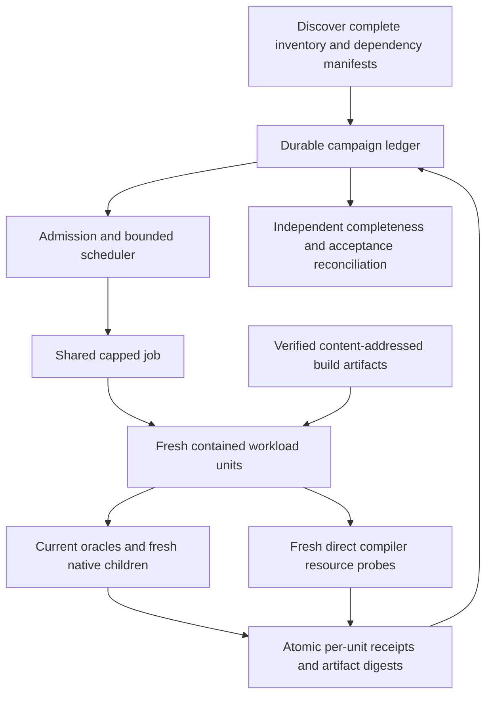

# PipeLang verification optimization architecture

For the subsequent v0.113.0 cost breakdown, compression research, and prioritized
experiments, see [performance and compression research](../research/pipelang-performance-compression.md).
That research does not change the implemented acceptance contract below.

Status: implemented and accepted, 2026-09-10; all five checkpoints complete.
Objective: `TASK-021-resumable-verification-optimization`.
The user requested full optimization of verification, an architectural plan, and
one fresh task to execute it. The language remains v0.109.0.

## Outcome and scope

Make complete verification faster and recoverable without reducing its proof.
Implement durable campaigns, dependency-aware invalidation, safe cache reuse,
bounded scheduling/batching, preparation reuse, linear reporting and useful phase
measurements. Tune the retained workflow from measured results. This is one
objective with automatic implementation checkpoints, not a new language slice.

Work belongs in `tests/containedexec/`, generated-validation helpers under
`src/lib/pipelang/*_test.go`, and their documentation. Existing generic compiler,
evaluator and engine semantics remain unchanged. If profiling exposes production
hotspots, record them separately; this objective does not authorize semantic
changes, a new runtime, speculative compression research or a compiler rewrite.

The [task record](../agents/tasks/pipelang-reactive-application-language/conformance-verification-optimization.md)
owns execution state. [Contained execution](../../tests/containedexec/README.md)
owns the implemented commands and schema. The checkpoints below define the
required acceptance; the completed terminal campaign is recorded below.

## Accepted implementation and measured result

The durable ledger, explicit fresh/resume modes, all-stage driver, verified build
and preparation stores, preservation-first disk budgets, conservative measured
batching and linear reporting are implemented. The completed terminal campaign
reconciled unchanged acceptance after the final source edits. No production
compiler or engine behavior was changed for this objective.

Evidence root:
`/home/jamie/.codex/visualizations/2026/09/10/01a089a6-9615-79f1-bfb2-fd72e289205d`.
The authoritative result is
`verification-data/campaigns/terminal/accepted-verification.json`, supported by
`terminal-job.json`, `terminal-acceptance-job.json` and atomic stage receipts.
`terminal-comparison.json` records the measured comparison and its limitations.
The [execution record](../agents/tasks/pipelang-reactive-application-language/conformance-verification-optimization.md)
links the focused checkpoint evidence and protected-state exception.

| Final evidence | Result |
| --- | --- |
| Complete semantic suite | 811 functions / 6,188 logical cases; all executed, no failed or resumed cases; baseline 810 / 6,187 retained plus one preparation regression check |
| Suite wall time | 4,297.08 s (71.62 min), versus 10,802.49 s (180.04 min) baseline; 6,505.41 s / 60.22% less |
| Complete stage job | 4,729.18 s (78.82 min), including suite, matrix, integration and editor |
| Independent final acceptance audit | 172.33 s; current dependency and artifact digests, baseline coverage and cleanup reconciled |
| Fresh isolated compiler matrix | 1,944 passed; maximum 71.980 MiB RSS / 0.985 s; unchanged 128 MiB / 5 s ceilings and no memory.high |
| Integration/editor | Nine integration checks and one editor check passed with fresh execution |
| Aggregate containment | Peak 1,612,947,456 bytes; zero swap/OOM; workload and audit cgroup trees removed |
| Native cache and execution | 13,041 verified hits, zero misses; 43,725 fresh native children |
| Suite logical serialization | 153,398,231 bytes, versus approximately 81.14 GB from the old repeated-history strategy; 99.81% less logical output |
| Retained cache/evidence budget | 84.43 GB under the configured 96 GiB budget; no deletion |
| Final matched two-worker sample | 12 singleton units: 22.238 s; nine groups: 20.431 s, 8.13% less; identical 12-case order, 84 generated audits, 84 native executions and 27 artifact uses |

The full-run speed comparison includes warm executable reuse: the baseline
populated most binaries, while the terminal run executed fresh semantic checks
against verified retained binaries. It is not a cold-cache or scheduler-only
speed claim. The full campaign conservatively used singleton units because its
baseline-cache binary digests differed from the sample profile; those measurements
were correctly rejected for grouping. The matched sample independently supports
three small warm pairs. The completed full run now supplies matching singleton
profiles for future invocations, which still require current inputs and verified
binaries. Logical serialized bytes are not physical disk traffic or CPU time.

Measured remaining costs include 2,619.09 summed seconds of artifact identity and
verification, 1,107.35 evaluator seconds, and 1,015.42 native-execution seconds.
These are nested/parallel spans and must not be added to total wall time. The
suite spent 6,971.61 summed workload seconds with 81.46% workload occupancy.
Final reconciliation deliberately rehashes retained proof, adding audit cost in
exchange for recovery integrity. No persisted stat-only digest shortcut was added.
Earlier paired telemetry-on/off checks showed no resolved positive overhead;
small wall-clock differences remain noisy. Uninstrumented details remain unknown.

Focused proof includes 13 ledger tests, five verification/scheduling/budget tests,
four existing planner tests, five live unit containment probes, three live shared
job probes, actual coordinator-crash recovery without replay, suite/matrix and
integration resumption, dependency invalidation, corrupt artifact/preparation
rejection and exact generated-source/fixture comparison. The original failed
sample and integration-path probe remain retained. An actual machine reboot and
non-Linux containment were not tested or claimed. No language successor is selected.

## Measured schedule adoption — performance round two

For a repeated complete warm campaign, pass the preceding accepted singleton
suite's `schedule-profile.json` to `verification_campaign.py --schedule-profile`.
The existing bounded pair scheduler is adopted as an explicit option for this
workflow; singleton execution remains the default. No additional scheduler or
compiler/helper source change was needed. The profile must match current
source dependencies, host, workers and policy, and every referenced binary is
rehashed. Source changes require fresh observations, never editing an old identity.

The 2026-09-10 full comparison used the same source, host/policy and retained
native cache as the accepted singleton control. It admitted 2297 pairs and
1594 singletons: 3891 groups instead of 6188. Every logical case still ran fresh.

| Cost, including preparation and verification | Singleton control | Measured pairs |
| --- | ---: | ---: |
| Complete suite, including profile admission/reconciliation | 4297.08 s | 3994.90 s |
| All-stage job | 4729.18 s | 4439.42 s |
| Independent acceptance | 172.33 s | 179.53 s, including exact ordered comparison |
| Job plus independent acceptance | 4901.51 s | 4618.95 s |

Suite time improved 7.03%; the complete workflow including independent acceptance
improved 5.76% (282.56 s saved). Artifact identity/verification fell from
2619.09 to 1673.35 summed seconds. Phase spans overlap and are not additive wall
time. These sequential runs do not control background host load and establish
no cold-cache benefit.

Independent acceptance reconciled unchanged coverage: 811 functions / 6188 logical
cases, 1944 fresh isolated compiles, nine integration checks and editor proof.
All 43725 ordered source/fixture audits and 43725 fresh native children match the
control exactly. Both runs had 13041 verified executable hits and zero misses.
No group retry was required. Compiler maxima were 71.949 MiB / 0.666 s against
unchanged 128 MiB / 5 s limits. Both job trees were removed with zero OOM or swap.

Small workloads do not inherit this adoption. The predeclared 27-case sample
preserved 274 ordered audits/children and 45 hits, but serial warm-build controls
averaged 32.74 s and pairs 33.18 s (1.34% slower). Loading the complete profile for
that sample took 171.10 s because it verified the full retained cache. Use the
corresponding singleton sample's profile when measuring a selection, and include
admission cost. Unknown/heavy cases, memory families and special harnesses remain
singletons; failed groups retain evidence and retry as linked singleton attempts.

An exploratory reusable hash-buffer probe reduced allocations from about 318 MB
to 10 MB with identical digests, but only saved about 7% of hash time. No helper
change was adopted from that isolated experiment. The six sample jobs cost
337.97 s as one-time investigation; their results and the probe remain retained.

The [round-two execution record](../agents/tasks/pipelang-reactive-application-language/conformance-verification-performance-round-2.md)
links the durable evidence. `terminal-comparison.json` records independent ordered
proof; `final-adoption.json` includes acceptance cost and the limited adoption.
The original architecture objective remains complete and no successor is selected.

## Measured baseline and limitations

Completed receipts: `/home/jamie/.cache/pipelang-v109-resume-20260909`.
Use `accepted-verification.json` to reconcile the two successful retries with
`suite/summary.json`, whose original failed entries are intentionally retained.

| Component | Observed cost |
| --- | --- |
| Full compiler suite | 10,802.49 s wall; 6,187 units, 810 functions, two workers |
| Unit workloads | 20,755.27 summed seconds; 96.1% of available worker time |
| Scheduling/containment/reporting residual | 423.62 s wall above ideal workload/2; not a separately timed containment measurement |
| Test harness bootstrap / suite rebuild | 24.75 s / 1.01 s workload |
| Accepted native artifact uses | 12,026 misses; 1,015 hits; 12,032 unique artifacts |
| Retained native artifacts / native build cache | 56.79 GB / 3.02 GB, decimal bytes |
| v109 layouts / memory family | 5,655.33 / 1,326.45 summed workload seconds |
| v108 / v107 layouts | 1,550.88 / 1,516.21 summed workload seconds |
| Isolated matrix | 1,944 cases; 381.26 s wall, 57.40 s summed compiler execution |
| Integration jobs | 44.79 + 60.71 s; includes one 30 s preparation timeout |
| Final acceptance/artifact audit | 3.93 s |
| Repeated suite summary serialization | About 81.14 GB logical output for a final 26.19 MB JSON file |

The serialization estimate follows the current full-history rewrite after every
row; it is not physical disk traffic or a measured CPU duration. Matrix reporting
has the same quadratic pattern. Its 323.86 s residual also includes process and
unit launch, cleanup and collection. These overlapping costs must not be added
as if they were independent phases.

Original fine-grained compile/native timing was disabled. Six bounded profiling
checks subsequently took 25.82 s overall, with unchanged source and ceilings:

| Layout partition | Fresh executable workload | Compile/link within it | Native execution within it | Warm executable workload |
| --- | ---: | ---: | ---: | ---: |
| v109 /179 | 1.260 s | 0.373 s | 0.090 s | 0.860 s |
| v109 /1797 | 13.441 s | 8.498 s | 1.385 s | 5.422 s |
| v108 /228 | 2.360 s | 0.946 s | 0.249 s | 1.338 s |

These were serial probes using warm Go build caches. Remaining time includes
source/fixture generation, evaluator/oracle work, hashing and preparation. The
32–60% per-sample benefit is not a whole-suite speed claim. The heaviest original
v109 unit took 21.50 s against a 25 s test deadline; blind grouping is unsafe.
The 126 empty v109 buckets consumed only 4.01 workload seconds; retain inventory
coverage and do not prioritize deleting these checks.

Pre-reboot suite/integration passes were observed, but their `/tmp` receipts and
caches were lost. Their exact duration cannot be recovered. The containment
repair also changed relevant inputs. Do not claim all repeated work was avoidable.

## Architecture and ownership

Keep `job.py` as the outside bounded supervisor and `run.py` as the per-unit
containment boundary. Add a small campaign/ledger module shared by
`pipelang_suite.py`, `matrix.py` and the integration driver. Extract the previously
ad hoc integration commands into a supported driver with the same nine checks.
The scheduler coordinates; it must never become an uncontained execution lane.
Keep existing entry points usable while adding explicit fresh/resume modes.

### Durable campaign and crash consistency

Use an explicit private absolute proof root outside `/tmp`, with a documented
user-cache default. This is harness data, not engine/package state. Separate
`campaigns/<id>/` (manifests, attempts, receipts, fixtures, reports) from immutable
content-addressed executable objects and toolchain-specific Go build caches.

The campaign manifest records schema, full inventory, dependency digests, toolchain
identity, settings, limits, verification policy and explicit stage dependencies.
Logical case IDs derive from named tests and parameter tuples, not changing batch
numbers. Scheduling groups have separate IDs and list every logical case.

Each attempt has its own directory and states `planned`, `running`, `passed`,
`failed` or `interrupted`. Preserve failures and link a successful retry to its
original attempt. Publish success only after exit status, complete case inventory,
required artifacts/digests, resource checks and process-tree cleanup all pass.
The controller writes the terminal receipt after the workload tree is gone.

Write files through a same-directory temporary file, flush and fsync, rename, then
fsync the parent directory. Publish the manifest last when creating a campaign.
Use an exclusive campaign-writer lock; readers consume committed receipts only.
On restart, discard no evidence: incomplete publication becomes an interrupted
attempt and only unaccepted work is rescheduled. A success missing cleanup proof
cannot be promoted merely because its old cgroup is now absent.

Atomic per-unit receipts are the source of truth. An append-only event stream and
periodic compact index are accelerators that can be rebuilt. Never rewrite all
prior detailed results after each completion or buffer all logs in memory.
Bound log retention/output and stream artifact inventories. Keep independently
completed receipts even if ordered result collection or the coordinator crashes.

### Dependency fingerprints and invalidation

Content identity, not branch, commit, timestamp or cache age, decides validity.
Hash dirty and untracked owned inputs as well as tracked files; include additions,
deletions, relevant executable modes, configuration and allowed environment.
Build explicit dependency closure per stage, initially conservative rather than
guessing a narrow set. Do not assume the existing PipeLang-only snapshot covers
Application IR, consumers, editor checks or transitive package dependencies.

| Evidence | Required input identity |
| --- | --- |
| Main test binary | Production and test dependency closure, embedded assets, modules, toolchain and build settings |
| Logical conformance result | Above plus test/oracle code, parameters, fixture contents/seeds, inventory and execution policy |
| Generated executable | Generated Go, driver/oracle Go, module/build inputs, exact toolchain and settings; binary digest verified before execution |
| Runtime expectations | Current Value/Trace fixtures, always recomputed and executed for a fresh check even when its executable is reused |
| Isolated compiler measurement | Generated fixture, importcfg and imported archive contents, compiler bytes/flags, host/kernel/runtime identity and resource policy |
| Integration/editor validation | Each check's transitive source, test, schema, snippet/config and dependency inputs |
| Containment proof | Runner/supervisor/monitor implementation, effective limits, runtime environment and policy |

Check identities before and after work; mid-run drift invalidates affected
results and descendants. Fail closed if dependency discovery is incomplete.
Changes to test discovery invalidate the schedule and force complete rediscovery.
A boot-ID change alone does not invalidate a completed receipt: that would defeat
reboot recovery. Compare effective host/kernel/toolchain/resource policy for
resource evidence; rerun affected resource checks when those inputs change.
A report-renderer-only change may regenerate views from valid evidence, but only
after its separation from execution/admission code is explicit and tested.

Distinguish `fresh` (execute every required check) from `resume` (continue the same
campaign, reusing valid completed receipts). If relevant inputs changed, produce
a revised manifest and rerun the affected dependency closure; preserve ancestry
and invalidation reasons. Unknown scope invalidates the entire affected stage.
Do not silently convert a requested fresh run into cached test results or import
historical receipts lacking the new fields as new acceptance proof.

### Safe caches and preparation

Reuse the existing generated artifact format and its corruption/source/oracle/
toolchain/settings checks. Keep current fixture generation and independent
evaluator, pristine-Go value and instrumented-Go trace checks. Executable reuse
never replaces these checks. Resource probes always perform a fresh target compile;
their prior receipts are reusable only as completed proof in a valid resumed campaign.

Retain standard dependency preparation and main test-binary builds across restart
when their full dependency identities match. Avoid repeated `go build` preparation
for every new bundle after successful cache-specific preparation. A missing or
damaged preparation entry triggers bounded reconstruction, not a relaxed deadline.
Keep preparation, compilation/linking, executable verification/publication and
execution as separately measured activities.

Continue hashing toolchain content correctly. First amortize the existing
process-local digest through safe grouping. Do not trust a persisted digest based
only on path/mtime/version; cross-process reuse requires a verified immutable
snapshot or equivalent demonstrable mutation protection. Defer that mechanism if
its cost outweighs the measured saving.

Expose cache hit/miss reasons, bytes, retained references and disk headroom.
Pin objects referenced by live campaigns and imported protected proof. Enforce a
configurable disk budget for newly owned caches without silently deleting existing
ones: stop new population cleanly and report required space if preservation would
exceed it. Garbage-collection design may identify unreferenced owned objects, but
no existing cache/proof cleanup is authorized by this objective.

### Bounded scheduling and batching

Keep a complete discovered logical inventory and schedule every required case
exactly once, except explicitly linked retries. Reuse existing eligible native
bundles and their special-harness exclusions. Group only compatible finite-shape
checks, initially in small warm groups. Retain fresh per-case native children,
fixture directories and current oracle execution inside each group.

Choose groups from observed elapsed and peak memory with conservative headroom;
start with a predicted workload below 10 seconds under the unchanged 25-second
test timeout. A cold miss or unknown profile selects the conservative small-unit
path. Record the plan and predictions so scheduling decisions are reproducible.
On an interrupted/failed group, only independently committed complete proofs may
be admitted; otherwise retry that group's work in smaller unchanged-limit units.

Keep direct compiler probes in their own units with their own RSS/time evidence.
Do not group memory families or special initialization/harness tests simply to
reduce launch count. Keep at most two workload workers and leave parallel shapes
off initially. Do not overlap separate stage jobs to evade the shared budget.
Before promoting grouping, compare flattened case identities, ordered source/
fixture audits, native-child counts and independent results against the baseline.

### Measurement and reporting

Record monotonic start/end timestamps and parent/span IDs for containment setup,
preparation, source/fixture generation, evaluator/oracle computation, compilation,
linking, artifact hashing/publication, native execution, cleanup and report writes.
Record UTC and boot ID for provenance; never subtract monotonic clocks across boots.
Keep nested/parallel spans distinguishable so wall, summed worker and CPU times
are not double-counted. Missing timing is unknown, not zero. Report retries as
attempt cost, identifying useful preparation retained from a failed attempt.

Produce compact totals and per-family p50/p95/max, workload occupancy, peak memory,
cache identity/miss counts, artifact counts/bytes and cumulative serialized bytes.
Detailed logs stay on disk. Telemetry must have measured bounded overhead and
must not mix reference/oracle calculations with the implementation under test.

## Invariants and acceptance

- Preserve parser/typechecker -> typed HIR -> target-neutral Core -> evaluator ->
  Core-only Go, Application IR, frozen contracts, negative/adversarial checks,
  current independent Value/Trace expectations and deterministic output audits.
- Baseline: 810 functions, 6,187 scheduled units before grouping, 6,498 v109 layouts
  (225 controls), 26,615,808 placement vectors, 73,728 independent-root vectors,
  1,944 scaling and isolated cases (216 zero controls), closure depth at most 7,
  and nine integration checks. New harness tests add coverage. Group count may
  change; logical case coverage and independent proof may not shrink.
- Preserve compiler acceptance of 128 MiB RSS and 5 seconds with normal inlining;
  retain normal execution GC, offline Go 1.25.13 settings, current child/per-unit
  deadlines, 1 GiB unit maximum, 700 MiB high where currently used, 800 MiB
  proactive stop, zero swap and 128 tasks. Do not impose a new memory.high on
  direct isolated matrix cases. Preparation-only `GOMEMLIMIT=600MiB` stays labeled.
- Preserve the shared 2 GiB maximum, 1,536 MiB high, 1,800 MiB proactive stop,
  384 tasks, 512 MiB/64-task coordinator, independent finite job deadline and
  verified cleanup. Host systemd access uses narrowly reviewed contained commands.
- A simulated crash/restart must preserve completed receipts without replay,
  reject partial/corrupt receipts, invalidate changed relevant inputs and retain
  unrelated valid proof. Test host/boot changes and artifact loss independently.
  Do not reboot the user's machine; controlled coordinator termination and fresh
  process recovery plus synthetic boot identity cover the automated proof.

## Execution checkpoints

| Step | Work and exit evidence |
| --- | --- |
| 1. Durable ledger and identity | Implement versioned manifests, atomic per-unit success, locking, conservative stage fingerprints and recovery using small synthetic units. Prove crash windows, tampering, input drift, missing artifacts, stale locks and cleanup admission. This is the handoff's first checkpoint. |
| 2. Resume all required stages | Integrate suite, matrix and supported integration driver. Replace quadratic reports. Prove complete reconciliation, changed-input closure, resumed scheduling and legacy-reader compatibility without rerunning the baseline suite. |
| 3. Persistent preparation and cache | Bind build/preparation reuse to exact inputs; retain cache validation and fresh oracles. Prove corruption, toolchain/settings/source/fixture changes, writer interruption and pinned disk-budget behavior. |
| 4. Profile and batch | Add bounded spans; compare a fixed predeclared representative sample, including heavy v109 shapes, older layouts, memory and special harnesses. Measure cold versus warm separately; tune small groups, retain singleton fallback and exact source/fixture/case audits. |
| 5. Complete verification and adoption | After final material edits, run one complete optimized terminal campaign under the unchanged aggregate limits. Reconcile all semantic, integration, resource, adversarial and containment proof. Compare totals to original receipts with cache-state caveats; add only narrowly necessary matched measurements. Document commands, schema, recovery, measured gains and remaining costs. |

Do focused proof at each step; do not repeat the full suite per checkpoint. A
failure, source drift or direct acceptance dependency can require additional
affected work. Implementation changes authorize one terminal full verification;
the old completed run remains baseline evidence, not proof of the new harness.

Complete when every architectural capability above is implemented and verified,
the optimized full campaign passes unchanged acceptance, crash recovery and
invalidation are proven, and matched measurements demonstrate retained benefits.
If a proposed optimization regresses whole-workflow cost or correctness, remove
that optimization and document the measured decision; do not declare a sampled
experiment alone to be full framework completion. No arbitrary speed target
justifies reduced proof or unbounded optimization research.

## Expected benefit and tradeoffs

The smallest useful deliverable is the ledger/resume path plus persistent cache
selection. At an unchanged halfway interruption it avoids roughly 90 minutes of
suite replay; an uninterrupted completely cold run benefits much less. For a full
execution with matching cached artifacts, 20–35 minutes saved is a planning
estimate extrapolating only the sampled layout families, not a guarantee. Report
actual measurements separately for cold population, warm execution and interrupted
resumption. Never compare only a warm candidate against a cold baseline as proof
of scheduler improvement.

Batching can amortize repeated toolchain hashing and launch costs but reduces
failure granularity and risks deadlines. The journal removes approximately 81 GB
of repeated logical report serialization, with unmeasured time benefit until
profiled. Persistent native artifacts consume tens of GB; preservation and budget
checks take precedence over filling the disk. Independently measured compiler
resource checks remain even though their launch/reporting cost exceeds execution.

No commit, push, publication, worktree, cache deletion, actual reboot, machine
configuration change or external service mutation is authorized. Ordinary local
implementation and bounded verification of this plan are authorized in the
receiver; a handoff does not require another implementation approval.

## Receipt reconciliation memory

Suite and final acceptance reconciliation retain compact case identity and
supersession metadata after validating each complete sealed receipt, input identity,
resource/cleanup evidence and artifact digest. They do not retain another full
receipt payload set beside the suite report. Recovery now retains only attempt
IDs, sequence numbers and supersession chains for retry linkage. Stage execution
indexes accepted receipts by compact references bound to their complete payload
digests. On reuse, it reloads one receipt and rechecks its envelope, payload binding,
current stage/input identity, resources, cleanup and every artifact. Host and live
input guards are also checked before reuse. Changed evidence fails closed.

Full attempts and receipts remain on disk in the existing schema; suite result
rows retain their complete reports. Explicit full-receipt consumers, including
fixture discovery, remain supported. Memory still includes case/reference metadata,
result rows, the current decoded receipt and serialization buffers; this is not an
unlimited-size or constant-memory JSON reader. The fixed 512 MiB coordinator cap
and all proof requirements remain unchanged.

The 2026-09-12 interrupted 4,707-group campaign OOM-killed while loading resume
receipts. Its exact allocation site was not sampled at the time. The bounded
[recovery objective](../agents/tasks/pipelang-reactive-application-language/bounded-resume-memory.md)
records new allocation attribution, retained-corpus stress and fresh recovery
validation separately from that historical failure. Keep original failed evidence;
historical loader fixtures never substitute for current fresh semantic proof.

The v0.111 acceptance run exposed the old duplicate-payload memory failure after
all semantic units had passed. The repair and same-cap historical-receipt stress
proof are recorded in [the slice record](../agents/tasks/pipelang-reactive-application-language/terminal-leaf-selector-value-arms.md).
The changed harness requires fresh fingerprinted terminal verification; retained
receipts from the failed aggregate job do not by themselves establish completion.

## Identity and fixture performance follow-up

The generated-test toolchain digest now reuses one 32-KiB content buffer within
each process while preserving the exact input walk, metadata, digest and native
sealing. The suite's `--no-toolchain-read-buffer` keeps the old allocation control.
`--identity-profile` reports separate wall costs; job/unit receipts capture
boundary cgroup CPU and pressure counters with unavailable values explicitly null.
Measured schedule profiles bind the buffer and profiling settings as well as
current input/host/worker/policy identity. There is no persisted toolchain digest.

Raw fixture loading remains unchanged. The sampled direct streaming consumer
preserved all oracles but did not consistently improve complete-path cost and
was rejected. Measurement receipts, limitations and terminal status are recorded
in the [approved performance objective](../agents/tasks/pipelang-reactive-application-language/identity-fixture-performance.md)
and [canonical performance report](../research/pipelang-performance-compression.md).

The follow-up is accepted: final matched controls observed 3.66% less wall time;
one complete fresh terminal plus independent acceptance took 112.87 minutes versus
119.43 for the historical warm baseline. All 8,859 logical cases, 2,922 isolated
compiler cases, nine integrations, editor proof and 49,526 ordered audits/native
children are preserved. Historical whole-run timing is not a causal buffer-only
estimate. See the linked report for CPU, pressure, preparation and retained-cost
limits. The subsequent pairing work is recorded below.

## Current v0.113.0 pair comparison

The [2026-09-12 measured round](../research/pipelang-performance-compression.md#current-profile-pair-scheduling-accepted-2026-09-12)
validated the existing opt-in scheduler on the current full singleton profile.
The fresh paired replacement plus independent acceptance took 104.655 minutes
versus 112.870 minutes for the accepted singleton control (8.215 minutes / 7.28%
less). All 8,859 cases, 49,526 ordered audits/fresh native children, 2,922 compiler
probes and integration/editor checks are preserved, with zero OOM/swap in the
accepted run. The research record separately charges the interrupted run and
failed OOM resume; the later recovery repair is described above.
Following the user-requested adoption, complete campaigns now automatically use
matching warm profiles, with singleton fallback and `--no-pair-scheduling` for
controls. The controller atomically saves successful complete-suite profiles;
paired runs retain verified original singleton observations for subsequent runs.
Standalone suites remain singleton by default. Profile admission, two workers,
fresh execution and all limits remain unchanged. See the
[implementation record](../agents/tasks/pipelang-reactive-application-language/automatic-pair-scheduling.md)
and [runner usage](../../tests/containedexec/README.md) for validation and switches.
The subsequent bounded recovery repair has its own objective and proof above.
